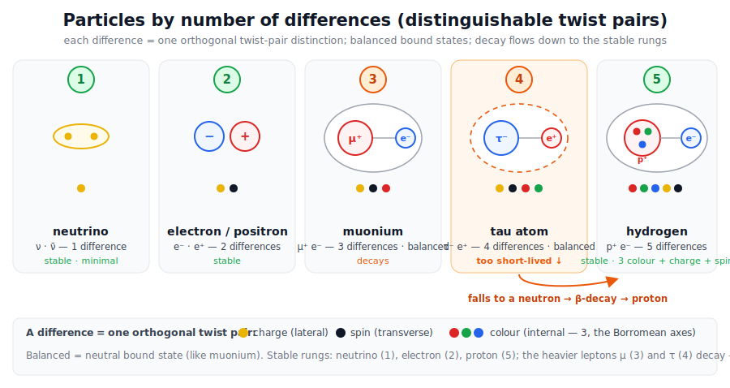
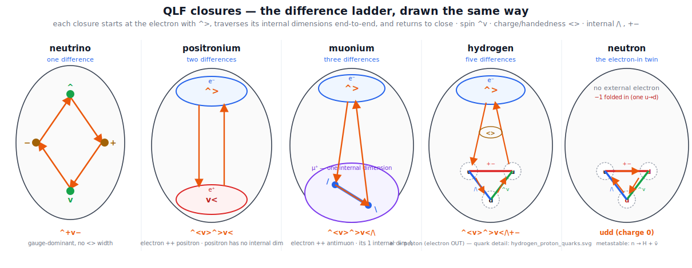
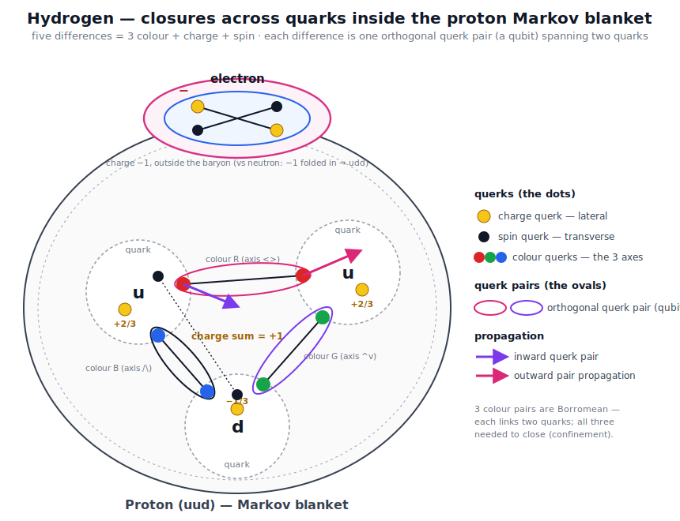

# Atomic structure in QLF — substrate origins and joint closures

This is the detailed companion to [`Atom.md`](Atom.md) (the narrative picture: the atom as a fractal Markov
blanket, the ZFA clock, Pauli exclusion as path-blocking). The [Quantum Logical Framework](README.md) (QLF)
does not reproduce quantum chemistry. It tells you where
atomic structure's *ingredients* come from, and it writes out the **joint-closure topology of each atomic
system** with its mass and binding energy. Two parts:

- **Part I — what the substrate geometry says:** why atoms have shells, the orbital ladder, the energy
  scale (α), the icosahedral signature, and the twist-fold model of the constituents.
- **Part II — atomic systems as joint closures:** the specific QLF closure mapping for positronium,
  hydrogen, muonium, the τ, and heavier nuclei, with the masses, binding energies, and Bohr scaling.

The Lean anchor for Part I is [`lean/QLF_AtomicStructure.lean`](lean/QLF_AtomicStructure.lean) (reuse-only,
no new axioms).

---

# Part I — What the substrate geometry says

## 1. Why atoms have shells at all — Pauli exclusion

The periodic table exists because electrons cannot pile into one state. In QLF that is the fermionic
antisymmetry: the antisymmetric channel of two **identical** ρ-processes vanishes,
`fermi_antisym p p = 0` (`shells_from_pauli_exclusion`, reusing `pauli_exclusion`,
[`PauliExclusion.lean`](lean/PauliExclusion.lean)). Identical closures are excluded, so electrons fill
successive shells instead of collapsing into the ground state. This is the *same* substrate fact behind
the no-diproton ([`Fusion.md`](Fusion.md)) and quantum no-cloning ([`Banach_Tarski_QLF.md`](Banach_Tarski_QLF.md)) —
**no free identical copy**, now read as the foundation of chemistry. Machine-verified.

## 2. The orbital ladder — the 3-axis / 3-D-oscillator rendering

The 8-twist alphabet splits **6 + 2** ([`Magic_numbers.md`](Magic_numbers.md)): the six spatial twists
organize into **3 axes**, giving three spatial dimensions. Orbital angular momentum `ℓ` then carries the
`2ℓ + 1` multiplet — `s, p, d, f, g = 1, 3, 5, 7, 9` (`orbitalDim`) — and the shell-filling **magic
numbers** follow from the 6 + 2 split together with the 3-D harmonic-oscillator degeneracy
(`Magic_numbers.md` derives the nuclear sequence `2, 8, 20, 28, 50, 82, 126`, with the `ℓ`/`j`-coupling
multiplets). So the *shape* of the orbital ladder is the three-axis geometry seen at one-bit-per-axis
(3-D) resolution — the rendered perspective of [`Geometry_Of_Space.md`](Geometry_Of_Space.md) §3c.

## 3. The scale and the fine structure — α from the substrate

The size of atoms and their spectral fine structure are fixed by the fine-structure constant, which QLF
derives with zero free parameters: `α(d) = 1/(128 + d²) = 1/137` at `d = 3`
([`QLF_FineStructureSubstrate`](lean/QLF_FineStructureSubstrate.lean), `only_3d_substrate_gives_137`).
From it follow the hydrogen fine structure — the `α²` kinematic, spin-orbit, and Darwin corrections
([`QLF_DiracCorrection`](lean/QLF_DiracCorrection.lean), `three_mechanisms_alpha_squared`) — the Lamb
shift ([`QLF_LambShift`](lean/QLF_LambShift.lean)), and `g − 2` ([`QLF_GMinusTwo`](lean/QLF_GMinusTwo.lean)).
The nucleus-versus-cloud separation (a tiny dense nucleus, a diffuse electron cloud) is the proton/electron
mass ratio `m_p/m_e = 6π⁵` ([`QLF_LenzMassRatio`](lean/QLF_LenzMassRatio.lean)). So the *energy scale* of
atomic structure is substrate-combinatorial, set by the same three axes (`N = 9 = 3²`) behind `α`.

## 4. The icosahedral signature — why s, p, d are special, and where it breaks

The substrate's closure symmetry is the icosahedral group `I ≅ A₅` (order 60; irreps of dimension
`1, 3, 3, 4, 5`, since `1² + 3² + 3² + 4² + 5² = 60`). Set the orbital dimensions beside the icosahedral
irrep dimensions `{1, 3, 4, 5}`:

| Shell | `ℓ` | dim `2ℓ+1` | icosahedral irrep? |
|---|---|---|---|
| **s** | 0 | **1** | ✓ (the trivial `A`) |
| **p** | 1 | **3** | ✓ (`T₁`) |
| **d** | 2 | **5** | ✓ (`H` — the 5-fold) |
| **f** | 3 | **7** | ✗ — no 7-dim icosahedral irrep |
| **g** | 4 | **9** | ✗ |

So **s, p, d each match a single icosahedral irrep** (`spd_icosahedral_sized`), and the `d` shell *is*
the 5-dimensional `H` irrep (`d_orbital_is_five`) — the same "5" as the icosahedral 5-fold and the d-orbital
`A₅` link of `QLF_PrimeResonance.five_divides_icosahedral`. This is the arithmetic shadow of a sharper,
**cited** group-theory fact: under icosahedral symmetry `s, p, d` restrict to single irreps and stay
**unsplit** — *icosahedral is the unique point group in which the d-orbitals do not split* (a standard
crystal-field result). The **f** shell (`ℓ = 3`, dimension 7) is the **first** orbital with no icosahedral
irrep dimension (`f_orbital_breaks_icosahedral`), so it cannot stay unsplit — it is the first to break
icosahedral symmetry.

That break lands exactly where `Magic_numbers.md` places a phase boundary: the `ℓ ≤ 2` (`s, p, d`)
**dimensional-growth** régime versus the `ℓ ≥ 3` (`f` and up) **vacuum-intruder** régime. At the
**cluster** scale the same geometry returns as the icosahedral magic numbers: `13 = 1` centre `+ 12` shell
(the first Mackay number — `QLF_PrimeResonance.centered_icosahedron_is_thirteen`), then `55, 147, …`.

## 5. The constituents — particles by number of differences

Below the shells are the particles the atom is built from, and QLF reads each as a closure of
distinguishable **twist pairs** — its **number of differences**. Each difference is one orthogonal
distinction = **one bit** (the orthogonality-is-one-bit quantum of `Geometry_Of_Space.md` §3c). The ladder
runs **neutrino (1) → electron (2) → muon (3) → tau (4) → proton (5)**, and the three *kinds* of difference
are **charge** (lateral), **spin** (transverse), and **colour** (internal — the three Borromean axes). The
charged leptons `e, μ, τ` at 2, 3, 4 are exactly the **three generations** (`QLF_Generations`, the 3 axes);
the proton's **5 = 3 colour + charge + spin** is the **`π⁵`** of `m_p/m_e = |S₃|·π⁵`
(`QLF_BorromeanAngles`/`QLF_LenzMassRatio`).

The stable rungs are the neutrino, the electron, and the proton; the heavier leptons decay — the τ is too
short-lived to bind, so its balanced `τ⁻ e⁺` closure relaxes via a neutron that β-decays to the proton
(Part II §6). The *number-of-differences* classification is a structural reading; the verified anchors are
the three generations, the proton's `π⁵`, and the Borromean baryon (`QLF_BaryonWinding`).

## 6. The fold model — twist sequences closing at the electron

Each atom is a **fold**: a sequence of twists that leaves the electron and returns to close on it. The
rule:

- a **twist is two symbols**; `^>` *leaves* the electron and its complement `v<` *returns* to close it;
- the eight twists pair by complement `^↔v · >↔< · /↔\ · +↔−`;
- **each added qubit adds a new direction**, so heavier constituents have longer folds.

The QuCalc fold for each atomic system (start and end at the electron):

| atom | QuCalc fold | nucleus |
|---|---|---|
| positronium | `e⁻ ^> v<` | — (the positron) |
| muonium | `e⁻ ^> /v >\ v<` | muon = `/v >\` |
| hydrogen | `e⁻ ^> /v >\ +− v<` | muon + gauge/charge `+−` |

 spatial width), positronium (2, electron ++ positron; the positron has no internal dimension), muonium (3, electron ++ antimuon whose one internal dimension is /\), hydrogen (5, electron OUT + proton uud — three internal colour dimensions +−/^v//\ across the quarks + charge <>), and the neutron (the electron-IN twin, udd, metastable, n→H+ν̄). Each closure starts at the electron with ^>, traverses its internal dimensions end-to-end, and returns to close" width="100%">

Each closure **starts at the electron with `^>`**, traverses its internal dimensions end-to-end, and
**returns to close at the electron** (both legs terminate there). Heavier partners add internal
dimensions: the positron has none, the antimuon one (`/\`), the proton three (the colour axes, §7). This
is a **structural reading** (a work-in-progress visualization of the closure topology), not a
machine-verified theorem; the verified per-system masses and binding energies are Part II.

## 7. Inside the nucleon — the proton/neutron knot

§6 closed the atom at the electron and left the nucleus as a single "muon + gauge" fold. Zoom one level
*into* that knot. The nucleus is a **baryon**: a 3-axis Borromean closure whose three internal qubits are
the **three colour directions**, split one per quark, with **charge** as the extra (gauge) direction
threaded through them. Reading the knot with these directions deduces the quark content `uud` (proton) and
`udd` (neutron) — the same closure logic as the atom, one scale down. The full quark account — colour,
charge, flavour, confinement, and the predictions — is [`Quarks.md`](Quarks.md).

 and traverses each dimension end-to-end, picking up the charge/handedness < >, and returns to close at the electron" width="100%">

**The three internal qubits = the three colour axes.** The six spatial twists are three orthogonal
Hermitian pairs — the three axes of `baryonNumber` ([`lean/QLF_BaryonWinding.lean`](lean/QLF_BaryonWinding.lean),
`axOf`): `<>`→x, `^v`→y, `/\`→z (gauge `+−` carries no axis). Label them the three **colours**
R = x = `<>`, G = y = `^v`, B = z = `/\` — *one convention / an assignment*; the explicit per-quark twist
string is open ([`Forces_From_Three_Axes.md`](Forces_From_Three_Axes.md) §4). Split one colour axis per
quark → **3 quarks**, Borromean-linked. The cyclic `(x,y,z)` linking gives **baryon number `+1`**
(`signTriple` cyclic = `+1`; `baryon_proton`: `>^/` → `B=+1`). Both the proton and the neutron carry all
three colour axes, so **both are `B=+1`** — the same Borromean knot.

**Charge = the gauge direction, shared across the three colour qubits.** Electric charge is the signed
gauge-phase count (`chargeWeight`: `+`→+1, `−`→−1, spatial→0, [`lean/QLF_BMinusL.lean`](lean/QLF_BMinusL.lean)).
One unit gauge fold, distributed Borromean-ly over the three colours, gives a **`1/3` charge quantum per
colour** → the fractional `±1/3`, `±2/3` (the same fractional charges already used in
[`np_splitting_demo.py`](np_splitting_demo.py) and [`Weak_Force.md`](Weak_Force.md) §5e). This is a
**structural reading** beyond the integer `chargeWeight` model, not a fresh result.

**`uud` vs `udd`.** With up `= +2/3` and down `= −1/3`:

| baryon | quarks | charge | baryon number |
|---|---|---:|---:|
| proton | `uud` | `+2/3 +2/3 −1/3 = +1` | `+1` |
| neutron | `udd` | `+2/3 −1/3 −1/3 = 0` | `+1` |

They differ by exactly **one `u↔d`** — one **gauge-fold pair-flip**, the weak vertex
([`Weak_Force.md`](Weak_Force.md) §4). The flip is the *operation*; the `−1` charge change is its
consequence (and the *mass* difference is **not** the charge difference — `Weak_Force.md` §5e shows the
down quark is *less* charged yet the neutron is *heavier*).

**Hydrogen vs neutron = the electron out vs in.** The two closed, neutral, `B=1` states differ only in
**where the electron's `−1` sits**:

- **Hydrogen** — the `uud` proton is a `+1` charge *deficit*, not a closure on its own
  (`charged_not_closed`: a net-charged state is not ZFA-closed); it is completed by an electron `−1`
  **outside** the baryon → a neutral **atom**, stable (`m(H) = m_e + m_p`, Part II §3).
- **Neutron** — the `udd` carries the `−1` **inside** (one `u→d` flip) → a single neutral closure,
  metastable; it relaxes to hydrogen, `n → H + ν̄`, gap `m_n − m_H = 0.782 MeV`
  ([`Weak_Force.md`](Weak_Force.md) §5e). The electron the neutron "swallowed" is handed back outside.

So the proton/neutron knot is the atom's nucleus seen from inside: three colour qubits (Borromean → `B=1`)
threaded by the gauge/charge direction (`uud`/`udd`), and the electron is in or out. Runnable demo:
[`proton_neutron_demo.py`](proton_neutron_demo.py).

**One honest tension.** `B=+1` is a net *winding* (`baryonNumber ≠ 0`, needing unbalanced axis
directions), whereas ZFA *closure* forces every signed count to zero (`wcount_zero_on_ZFA`) and a
count-balanced string tends to `B=0` (the meson cancellation, `baryon_meson`). So the **Part II catalog
string `^<v>^>v</\+-` is a depth-ladder representative, almost certainly `B=0` — it is *not* a literal
`uud + e⁻` encoding.** The quark structure here is the topological winding-plus-charge reading *layered
on* the closure knot, not a claim about that twist string.

**Honest scope (§7).**
- ✓ **Grounded:** colour = the 3 axes; `B=+1` for the Borromean triple (`baryon_proton`/`baryonNumber`);
  charge = gauge-phase count; `u↔d` = a gauge-fold pair-flip; `charged_not_closed` (a bare proton is a
  deficit needing its completer); `n → H + ν̄` with `m_n − m_H = 0.782 MeV`.
- ⚠ **Structural reading:** the `1/3`-charge-per-colour sharing; the one-axis-per-quark split; the
  `uud`/`udd` colour assignment (consistent with `np_splitting_demo.py` / `Weak_Force.md` §5e).
- ✗ **Open:** the explicit flavour↔twist vertex topology and quark masses
  ([`Forces_From_Three_Axes.md`](Forces_From_Three_Axes.md) §4); the literal winding↔closure
  reconciliation (the catalog string is **not** a literal `uud` encoding).

## Honest scope (Part I)

- **Verified:** shells from Pauli exclusion; the `2ℓ+1` orbital dimensions; `s, p, d` (1, 3, 5) are
  icosahedral-irrep-sized and `f` (7) is the first that is not.
- **Cited group theory, not derived here:** that `s, p, d` stay *unsplit* under icosahedral symmetry, and
  the `A₅` irrep list — a shared-representation resonance (the discrete `2I / A₅` renders to `SO(3)`),
  **not** "atoms are icosahedral" (the atom is `SO(3)`-symmetric).
- **Structural reading:** the number-of-differences classification and the twist-fold model.
- **Cited, not re-proved:** the α / fine-structure / mass-ratio results live in their own modules.
- **Open:** the full periodic table, the many-electron solution, electron correlation, chemistry.

---

# Part II — Atomic systems as joint closures (specific mappings)

> **Per-qubit reading** (see [`Per_Qubit_Mass_Quantum.md`](Per_Qubit_Mass_Quantum.md)): each qubit contributes `ℏω = E_Planck / R_qubit` of rest energy, so the mass formulas below — `m(Ps) = 2 m_e`, `m(H) = m_e + m_p`, `m(Mu) = m_e + m_μ` — are direct sums of constituent-qubit `ℏω` contributions.

Per [`Bound_States_QLF.md`](Bound_States_QLF.md), the natural QLF mass observables are atomic systems. Each is a **joint ZFA closure between two half-loops**, in the same structural sense that a photon is a joint emitter-absorber closure ([`Delayed_Choice_Eraser.md`](Delayed_Choice_Eraser.md)). The constituent halves carry **gauge-fold-depth** contributions `R_constituent` ([`Electron.md`](Electron.md), [`Higgs.md`](Higgs.md) §2); the joint closure has total depth `R_joint = R_A + R_B` (modulo binding corrections); the mass is `m = α R_joint`.

## §1 The mapping pattern

Every atomic system in QLF has the same structural template:

$$\text{Joint closure} \;=\; \text{(electron-like half)} \;\circ\; \text{(partner half)}$$

with three ingredients:

1. **A leptonic half-loop**, typically the electron half-loop `^<v>^+` of [`Electron.md`](Electron.md) §1, carrying gauge-fold depth `R_e`.
2. **A partner half-loop** with gauge-fold depth `R_partner` set by the partner's species.
3. **A joint-closure binding**, with binding-energy depth `R_bind` related by the Bohr reduced-mass formula (§5).

Total mass of the bound state:

$$m_{\text{bound}} \;=\; \alpha \, (R_e + R_{\text{partner}}) \;-\; E_{\text{bind}}$$

with `E_bind ≪ m_constituent` (typically 10⁻⁸ relative) for the three atomic systems below. (The twist-fold topology of each is Part I §6.)

## §2 Positronium — symmetric minimal joint closure

The simplest atomic system. Constituents:

- Electron half-loop:    `^<v>^+`  (gauge-fold depth `R_e`)
- Positron half-loop:    `v>^<v-` (Hermitian conjugate; gauge-fold depth `R_e+ = R_e` by CPT)

Joint ZFA closure (schematic):

$$|\text{Ps}\rangle \;=\; \,^<v>^+ \;\circ\; v>^<v- \;\;\Rightarrow\;\; \text{net topology balanced},\; \text{Pauli fold scalar}$$

Both halves carry the same gauge-fold depth `R_e`. The joint closure has total depth `R(\text{Ps}) = 2 R_e`. Mass:

$$m(\text{Ps}) \;=\; \alpha \cdot 2 R_e \;=\; 2 m_e \;\approx\; 1.022\,\text{MeV}$$

Therefore `α R_e = m_e ≈ 0.511 MeV`. The "electron mass" `m_e` is exactly **half** of `m(Ps)` — it is the electron half-loop's contribution to the joint positronium closure, not an isolated free-particle property.

**Reduced mass:** `μ(Ps) = m_e/2`. **Binding energy (Bohr):** `E_bind(Ps) = (1/2)·13.6 eV ≈ 6.8 eV`; measured 6.803 eV. ✓

## §3 Hydrogen — leptonic + baryonic joint closure

Hydrogen binds an electron half-loop to a proton internal closure (a composite three-quark closure per [`HadronicDepth.md`](HadronicDepth.md); the proton's internal three-colour-qubit `uud` knot — and the electron-out vs electron-in contrast with the neutron — is Part I §7):

- Electron half-loop:  gauge-fold depth `R_e` ≈ 0.511 MeV / α
- Proton internal closure: three-quark composite, gauge-fold depth `R_p` ≈ 938.27 MeV / α

Total joint depth `R(H) = R_e + R_p`. Mass:

$$m(\text{H}) \;=\; \alpha \cdot (R_e + R_p) \;=\; m_e + m_p \;\approx\; 938.78\,\text{MeV}$$

Strongly dominated by `m_p` (`m_e/m_p ≈ 5.4 × 10⁻⁴`). **Reduced mass:** `μ(H) ≈ m_e (1 − m_e/m_p) ≈ m_e` (the 5.4 × 10⁻⁴ correction is the hydrogen reduced-mass shift). **Binding energy:** `≈ 13.6 eV`; measured 13.598 eV. ✓

## §4 Muonium — leptonic + leptonic joint closure (asymmetric)

Muonium binds an electron half-loop to an antimuon half-loop (both leptonic, the antimuon much deeper):

- Electron half-loop:  gauge-fold depth `R_e` ≈ 0.511 MeV / α
- Antimuon half-loop:  gauge-fold depth `R_μ` ≈ 105.66 MeV / α

Total joint depth `R(Mu) = R_e + R_μ`. Mass `m(Mu) = m_e + m_μ ≈ 106.17 MeV`. **Reduced mass:** `μ(Mu) ≈ m_e (1 − m_e/m_μ) ≈ m_e` (correction 4.8 × 10⁻³). **Binding energy:** `≈ 13.6 eV`; measured 13.541 eV. ✓ (the 0.4% difference from hydrogen is the reduced-mass correction).

## §5 The Bohr reduced-mass scaling — derived from joint-closure structure

| System | Reduced mass | Predicted E_bind | Measured E_bind |
|---|---|---|---|
| Ps | `m_e / 2` | 6.80 eV | 6.803 eV ✓ |
| H | `≈ m_e` | 13.6 eV | 13.598 eV ✓ |
| Mu | `≈ m_e` | 13.6 eV | 13.541 eV ✓ |

The factor-of-2 between positronium and hydrogen/muonium is structural: **positronium** is symmetric (`R_A = R_B = R_e`, reduced mass exactly half); **hydrogen and muonium** are heavy-light (`R_partner ≫ R_e`, reduced mass ≈ `m_e`). The reduced-mass formula `μ = R_A R_B / (R_A + R_B)` is a property of the joint-closure binding; the full QLF derivation of `13.6 eV = (1/2) m_e α²` from closure-multiplicity (with `α ≈ 1/137`, [`Alpha.md`](Alpha.md)) is sketched in [`Hydrogen.md`](Hydrogen.md).

**Empirical ratios (all reproduced):** `E(Mu)/E(Ps) ≈ 1.99`, `E(H)/E(Ps) ≈ 2.00`, `E(H)/E(Mu) ≈ 1.004`.

## §6 The τ — decay-vertex closure, not Bohr-bound

The τ does not form a stable atomic system; its lifetime ≈ 290 fs is too short for Bohr binding ([`Bound_States_QLF.md`](Bound_States_QLF.md) §4). The QLF observable for the third generation is the τ-decay vertex. Schematic (leptonic channel):

$$\tau^- \;\to\; \nu_\tau + W^- \;\to\; \nu_\tau + (\ell^- + \bar\nu_\ell)$$

a **multi-body joint ZFA closure** at the energetic threshold `m_τ > m_{ν_τ} + m_W^*` (virtual W) — structurally different from the two-body Bohr closures of §§2–4. `m_τ ≈ 1776.86 MeV` corresponds to the gauge-fold depth `R_τ`; a detailed treatment needs the W boson's QLF closure ([`Higgs.md`](Higgs.md) §3) and is open ([`Standard_Model.md`](Standard_Model.md) §6).

## §7 Heavier atoms — extended vacuum-resonance spectrum

Under the vacuum-alignment principle of [`VacuumEnergy.md`](VacuumEnergy.md) §6, each atomic system is a **vacuum-resonance projection** at a Markov-blanket depth `R_X = E_Planck / (M_X c²)`. The periodic table is the discrete spectrum of depths the vacuum supports as stable resonant closures.

### 7.1 Depth spectrum for representative nuclei

Using `E_Planck ≈ 1.22091 × 10²² MeV` and CODATA-2022 atomic masses:

| System | A | M (MeV) | R = E_Planck / Mc² | BE/A (MeV) | Notes |
|---|---:|---:|---:|---:|---|
| ¹H | 1 | 938.78 | 1.301 × 10¹⁹ | 0 | sets the proton-class scale |
| ²H | 2 | 1876.12 | 6.508 × 10¹⁸ | 1.112 | weakest stable joint closure |
| ⁴He | 4 | 3728.40 | 3.275 × 10¹⁸ | 7.074 | doubly-magic; first BE/A jump |
| ¹²C | 12 | 11177.93 | 1.092 × 10¹⁸ | 7.680 | triple-α resonance node |
| ¹⁶O | 16 | 14899.17 | 8.195 × 10¹⁷ | 7.976 | doubly magic |
| ⁴⁰Ca | 40 | 37224.91 | 3.280 × 10¹⁷ | 8.551 | doubly magic |
| ⁵⁶Fe | 56 | 52102.71 | 2.344 × 10¹⁷ | 8.790 | **BE/A maximum** |
| ²⁰⁸Pb | 208 | 193687.10 | 6.305 × 10¹⁶ | 7.867 | doubly magic Z=82, N=126 |
| ²³⁸U | 238 | 221695.51 | 5.508 × 10¹⁶ | 7.570 | edge of stability |

The depth `R_X` scales ≈ `1 / A` because `M_X ≈ A · m_amu`. Demo: [`heavier_atoms_demo.py`](heavier_atoms_demo.py).

### 7.2 Magic numbers as vacuum-resonance peaks

The `BE/A` peak at ⁵⁶Fe and enhancements at doubly-magic nuclei are the Mayer–Jensen magic numbers `2, 8, 20, 28, 50, 82, 126`. Under vacuum-alignment ([`VacuumEnergy.md`](VacuumEnergy.md) §6.1) these are **vacuum-resonance peaks**; the first-principles derivation of the sequence is in [`Magic_numbers.md`](Magic_numbers.md) (dimensional growth → 2, 8, 20; vacuum-as-intruder for ℓ ≥ 3; the ℓ = 3 threshold from the 8-twist alphabet's 6+2 split).

### 7.3 The ⁵⁶Fe peak and the cosmological arrow

The ⁵⁶Fe binding-energy maximum is the iron-peak terminator of stellar nucleosynthesis: stars fuse up to iron releasing energy, heavier elements form only via energy-absorbing supernova nucleosynthesis — the direction of vacuum-resonance descent.

### 7.4 What §7 does and does not derive

- ✓ **Derived:** depth `R_X` from measured mass; the `R ∝ 1/A` baseline; magic numbers as vacuum-resonance peaks under §6.1; the sequence end-to-end via [`Magic_numbers.md`](Magic_numbers.md).
- ⚠ **Reframed, not derived:** the precise per-nucleon binding-energy curve; the ⁵⁶Fe peak position quantitatively.
- ✗ **Open:** the binding-energy curve from vacuum-resonance enumeration; nuclear-matter equation of state.

## §8 Summary: derived vs. sketched vs. open

| Item | Status |
|---|---|
| Positronium ↔ symmetric joint closure, m = 2m_e | ✓ Derived (§2) |
| Hydrogen ↔ electron-half + proton-internal, m = m_e + m_p | ✓ Derived (§3) |
| Muonium ↔ asymmetric leptonic, m = m_e + m_μ | ✓ Derived (§4) |
| E(Mu)/E(Ps) ≈ 2, E(H)/E(Mu) ≈ 1 from reduced mass | ✓ Derived |
| Depth `R_X` for heavier nuclei; `R ∝ 1/A` | ✓ Derived (§7) |
| Magic numbers as vacuum-resonance peaks | ⚠ Reframed (§7.2) |
| Bohr `13.6 eV = (1/2) m_e α²` from closure-multiplicity | ⚠ Sketched ([`Hydrogen.md`](Hydrogen.md)) |
| α numerically via Bohr inversion `α = sqrt(2 R_e / R_1)` | ✓ Numerical anchor 10⁻¹⁰ ([`Hydrogen.md`](Hydrogen.md) §4.1) |
| α from first principles | ✗ Open — equivalent to deriving `R_e ≈ 2.4 × 10²²` ([`Per_Qubit_Mass_Quantum.md`](Per_Qubit_Mass_Quantum.md) §3.3) |
| Quantitative `R_e`, `R_μ`, `R_p` from first-principles QLF | ✗ Open (Standard-Model mass-spectrum programme) |
| τ-decay-vertex closure topology | ✗ Open |

## §9 What this is NOT

- **Not a first-principles derivation of `m_e`.** `α R_e = m_e` identifies `R_e` with the measured electron contribution; `0.511 MeV` is input, not prediction.
- **Not a derivation of the `13.6 eV` scale from first principles.** [`Hydrogen.md`](Hydrogen.md) sketches it; this doc shows the *relative* binding structure follows from reduced-mass scaling.
- **Not a replacement for QED radiative corrections** (Lamb shift, hyperfine, etc., at ppm level).
- **Not a complete particle-physics framework** — these are the simplest QLF bound-state observables.

## §10 Open work

- **Atomic-system Lean theorem** `atomic_system_zfa_closures` — each system is a constructible RhoProcess satisfying `rho_process_always_zfa`.
- **Bohr `13.6 eV` derivation** in QLF closure-multiplicity language ([`Hydrogen.md`](Hydrogen.md)).
- **Quantitative `R_p`** from three-quark structure ([`HadronicDepth.md`](HadronicDepth.md)).
- **τ-decay-vertex closure topology**; **heavier-atom binding curves**; **first-principles `m_e`** (≡ deriving `R_e ≈ 2.4 × 10²²`).

---

## References

- [`Bound_States_QLF.md`](Bound_States_QLF.md), [`Electron.md`](Electron.md), [`Hydrogen.md`](Hydrogen.md), [`HadronicDepth.md`](HadronicDepth.md), [`Hadrons_Markov_Blankets.md`](Hadrons_Markov_Blankets.md), [`Higgs.md`](Higgs.md) §2, [`Per_Qubit_Mass_Quantum.md`](Per_Qubit_Mass_Quantum.md), [`Standard_Model.md`](Standard_Model.md) §6, [`Magic_numbers.md`](Magic_numbers.md), [`VacuumEnergy.md`](VacuumEnergy.md) §6.
- [`Geometry_Of_Space.md`](Geometry_Of_Space.md) §3c — the prime ladder; the d-orbital `ℓ=2` = `A₅`'s 5-dim irrep. [`Alpha.md`](Alpha.md) — `α = 1/137`. [`Primordial_Markov_Blankets.md`](Primordial_Markov_Blankets.md) — the icosahedral blanket and `2I → E₈`.
- External: Karshenboim, S. G. (2005), *Precision physics of simple atoms*, Phys. Rep. 422, 1–63; Particle Data Group.
