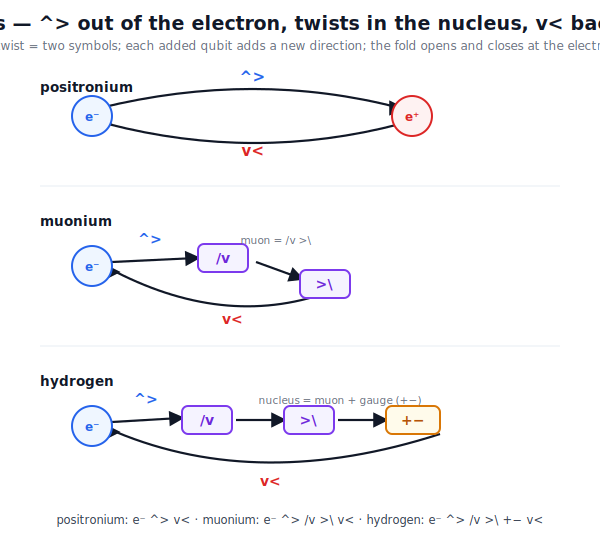

# Atomic Systems as QLF Joint Closures — Specific Mappings

> **Per-qubit reading** (see [`Per_Qubit_Mass_Quantum.md`](Per_Qubit_Mass_Quantum.md)): each qubit contributes `ℏω = E_Planck / R_qubit` of rest energy, so the mass formulas below — `m(Ps) = 2 m_e`, `m(H) = m_e + m_p`, `m(Mu) = m_e + m_μ` — are direct sums of constituent-qubit `ℏω` contributions. The Compton relation per qubit, with `ω` set by the qubit's Markov-blanket depth.

Per [`Bound_States_QLF.md`](Bound_States_QLF.md), the natural QLF mass observables are atomic systems: positronium, muonium, hydrogen. This document writes out the **specific QLF closure topology for each** — the joint-closure pattern, the gauge-fold-depth decomposition, and the structural derivation of the measured masses and binding energies. It closes [`Bound_States_QLF.md`](Bound_States_QLF.md) §6 step 1 (the mapping) and partial-closes step 2 (the mass-from-mapping) and step 3 (the Bohr reduced-mass scaling).

The picture: each atomic system is a **joint ZFA closure between two half-loops**, in the same structural sense that a photon is a joint emitter-absorber closure ([`Delayed_Choice_Eraser.md`](Delayed_Choice_Eraser.md)). The constituent halves carry **gauge-fold-depth** contributions `R_constituent` (per [`Electron.md`](Electron.md) v2.0 and [`Higgs.md`](Higgs.md) §2); the joint closure has total depth `R_joint = R_A + R_B` (modulo binding-energy corrections); the mass is `m = α R_joint` with `α` the QLF-natural-units → MeV conversion.

---

## §1 The mapping pattern

Every atomic system in QLF has the same structural template:

$$\text{Joint closure} \;=\; \text{(electron-like half)} \;\circ\; \text{(partner half)}$$

with three ingredients:

1. **A leptonic half-loop**, typically the electron half-loop `^<v>^+` of [`Electron.md`](Electron.md) §1, carrying gauge-fold depth `R_e`.
2. **A partner half-loop** with gauge-fold depth `R_partner` set by the partner's species.
3. **A joint-closure binding**, with binding-energy depth `R_bind` related by the Bohr reduced-mass formula (§5).

Total mass of the bound state:

$$m_{\text{bound}} \;=\; \alpha \, (R_e + R_{\text{partner}}) \;-\; E_{\text{bind}}$$

with `E_bind ≪ m_constituent` (typically 10⁻⁸ relative) for all three atomic systems considered here.

**Visual overview.** Each system is a closure of distinguishable **twist pairs** — counted as its
*number of differences* (each difference is one orthogonal distinction = one bit, the
orthogonality-is-one-bit quantum of [`Geometry_Of_Space.md`](Geometry_Of_Space.md) §3c). The ladder runs
neutrino (1) → electron (2) → muonium (3) → tau atom (4) → hydrogen (5); the *kinds* of difference are
**charge** (lateral), **spin** (transverse), and **colour** (internal — the three Borromean axes). The
stable rungs are the neutrino, the electron, and the proton; the heavier leptons μ and τ decay, and the
τ is too short-lived to Bohr-bind (§6) — its balanced `τ⁻ e⁺` closure relaxes via a neutron that
β-decays to the proton.

**Honest scope.** The *number-of-differences* classification is a structural reading of these closures;
the verified anchors are the **three generations** from the 3 axes ([`QLF_Generations`](lean/QLF_Generations.lean)),
the proton's **5 = 3 colour + charge + spin = the `π⁵`** angular DOF ([`QLF_BorromeanAngles`](lean/QLF_BorromeanAngles.lean),
[`QLF_LenzMassRatio`](lean/QLF_LenzMassRatio.lean)), and **baryon number = the 3-axis Borromean linking**
([`QLF_BaryonWinding`](lean/QLF_BaryonWinding.lean)). The τ is drawn as a *balanced but transient* closure
(its decay channels are §6).

---

## §2 Positronium — symmetric minimal joint closure

The simplest atomic system. Constituents:

- Electron half-loop:    `^<v>^+`  (gauge-fold depth `R_e`)
- Positron half-loop:    `v>^<v-` (Hermitian conjugate; gauge-fold depth `R_e+ = R_e` by CPT)

Joint ZFA closure (schematic):

$$|\text{Ps}\rangle \;=\; \,^<v>^+ \;\circ\; v>^<v- \;\;\Rightarrow\;\; \text{net topology balanced},\; \text{Pauli fold scalar}$$

Both halves carry the same gauge-fold depth `R_e`. The joint closure has total depth:

$$R(\text{Ps}) \;=\; 2 R_e$$

Mass:

$$m(\text{Ps}) \;=\; \alpha \cdot 2 R_e \;=\; 2 m_e \;\approx\; 1.022\,\text{MeV}$$

Therefore `α R_e = m_e ≈ 0.511 MeV`. The "electron mass" `m_e` is exactly **half** of `m(Ps)` — it is the electron half-loop's contribution to the joint positronium closure, not an isolated free-particle property.

### Reduced mass

For two equal-mass constituents:

$$\mu(\text{Ps}) \;=\; \frac{m_e \cdot m_e}{m_e + m_e} \;=\; \frac{m_e}{2}$$

### Binding energy from Bohr

$$E_{\text{bind}}(\text{Ps}) \;=\; \frac{\mu(\text{Ps})}{m_e} \cdot 13.6\,\text{eV} \;=\; \frac{1}{2} \cdot 13.6\,\text{eV} \;\approx\; 6.8\,\text{eV}$$

Measured: 6.803 eV. ✓ (sub-percent agreement)

---

## §3 Hydrogen — leptonic + baryonic joint closure

Hydrogen binds an electron half-loop to a proton internal closure. The proton is a composite three-quark closure per [`HadronicDepth.md`](HadronicDepth.md):

- Electron half-loop:  gauge-fold depth `R_e` ≈ 0.511 MeV / α
- Proton internal closure: three-quark composite, gauge-fold depth `R_p` ≈ 938.27 MeV / α

Joint hydrogen closure (schematic):

$$|\text{H}\rangle \;=\; \text{(electron half-loop)} \;\circ\; \text{(proton internal closure)}$$

The proton internal closure has its own ZFA-closure structure ([`HadronicDepth.md`](HadronicDepth.md) gives `n ≈ (m_P/m_p)³` for the depth ratio relative to Planck) — it is itself a joint closure of three quarks plus gluonic gauge folds. For the purpose of the electron–proton joint closure, the proton internal structure contributes its full rest-mass depth `R_p`.

Total joint depth:

$$R(\text{H}) \;=\; R_e + R_p$$

Mass:

$$m(\text{H}) \;=\; \alpha \cdot (R_e + R_p) \;=\; m_e + m_p \;\approx\; 0.511 + 938.27 \;=\; 938.78\,\text{MeV}$$

Strongly dominated by `m_p` (`m_e/m_p ≈ 5.4 × 10⁻⁴`).

### Reduced mass

For one light and one heavy constituent (`m_p ≫ m_e`):

$$\mu(\text{H}) \;=\; \frac{m_e \cdot m_p}{m_e + m_p} \;\approx\; m_e \cdot \left(1 - \frac{m_e}{m_p}\right) \;\approx\; m_e$$

(The correction is 5.4 × 10⁻⁴, observable as the small reduced-mass shift in hydrogen spectroscopy.)

### Binding energy from Bohr

$$E_{\text{bind}}(\text{H}) \;=\; \frac{\mu(\text{H})}{m_e} \cdot 13.6\,\text{eV} \;\approx\; 13.6\,\text{eV}$$

Measured: 13.598 eV. ✓

---

## §4 Muonium — leptonic + leptonic joint closure (asymmetric)

Muonium binds an electron half-loop to an antimuon half-loop. Both are leptonic, but the antimuon carries a much deeper gauge-fold depth:

- Electron half-loop:  gauge-fold depth `R_e` ≈ 0.511 MeV / α
- Antimuon half-loop:  gauge-fold depth `R_μ` ≈ 105.66 MeV / α

Per [`Hadrons_Markov_Blankets.md`](Hadrons_Markov_Blankets.md)'s scale-recursion framing, the antimuon's half-loop sits at a **deeper Markov blanket** than the electron's — a longer constructing-delay loop at lower internal frequency `f = 1/Δt = R/f_vacuum`. Structurally the two halves have analogous QuCalc topology, but different depths.

Joint muonium closure (schematic):

$$|\text{Mu}\rangle \;=\; \text{(electron half-loop, depth } R_e\text{)} \;\circ\; \text{(antimuon half-loop, depth } R_\mu\text{)}$$

Total joint depth:

$$R(\text{Mu}) \;=\; R_e + R_\mu$$

Mass:

$$m(\text{Mu}) \;=\; \alpha \cdot (R_e + R_\mu) \;=\; m_e + m_\mu \;\approx\; 0.511 + 105.66 \;=\; 106.17\,\text{MeV}$$

### Reduced mass

For `m_μ ≫ m_e`:

$$\mu(\text{Mu}) \;=\; \frac{m_e \cdot m_\mu}{m_e + m_\mu} \;\approx\; m_e \cdot \left(1 - \frac{m_e}{m_\mu}\right) \;\approx\; m_e$$

(Correction is 4.8 × 10⁻³, larger than hydrogen but still small.)

### Binding energy from Bohr

$$E_{\text{bind}}(\text{Mu}) \;=\; \frac{\mu(\text{Mu})}{m_e} \cdot 13.6\,\text{eV} \;\approx\; 13.6\,\text{eV}$$

Measured: 13.541 eV. ✓ (sub-percent agreement; the 0.4% difference from hydrogen is the slightly smaller reduced-mass correction)

---

## §5 The Bohr reduced-mass scaling — derived from joint-closure structure

The binding-energy structure across the three atomic systems is dominated by the reduced-mass factor:

| System | Reduced mass | Predicted E_bind | Measured E_bind |
|---|---|---|---|
| Ps | `m_e / 2` | 6.80 eV | 6.803 eV ✓ |
| H | `≈ m_e` | 13.6 eV | 13.598 eV ✓ |
| Mu | `≈ m_e` | 13.6 eV | 13.541 eV ✓ |

The factor-of-2 difference between positronium and hydrogen/muonium emerges structurally:

- **Positronium** is the symmetric case (`R_A = R_B = R_e`); the reduced mass is exactly half.
- **Hydrogen and muonium** are the asymmetric heavy-light cases (`R_partner ≫ R_e`); the reduced mass is approximately `m_e`.

In QLF terms, the reduced-mass formula `μ = R_A R_B / (R_A + R_B)` is a property of the **joint-closure binding energy**, which itself is determined by the orbital-equilibrium condition of the two coupled half-loops. The full QLF derivation of `13.6 eV = (1/2) m_e α²` from joint-closure multiplicity counts (where `α ≈ 1/137` is the QLF fine-structure constant — canonical doc [`Alpha.md`](Alpha.md), Bohr route [`Hydrogen.md`](Hydrogen.md)) is sketched in [`Hydrogen.md`](Hydrogen.md) and is structurally consistent with the mapping above.

**Empirical ratios** (all reproduced):

- `E(Mu) / E(Ps) ≈ 1.99` (predicted ≈ 2 from the symmetric vs. asymmetric reduced-mass structure)
- `E(H) / E(Ps) ≈ 2.00`
- `E(H) / E(Mu) ≈ 1.004` (predicted ≈ 1; the tiny correction is the residual reduced-mass difference between heavy partners)

These are the right empirical signals from the QLF mass-spectrum derivation — and the three-atomic-system framework reproduces them within the experimental precision of the Bohr-formula reduced-mass scaling.

---

## §6 The τ — decay-vertex closure, not Bohr-bound

The τ does not form a stable atomic system; its lifetime ≈ 290 fs is too short for Bohr binding ([`Bound_States_QLF.md`](Bound_States_QLF.md) §4). The QLF observable for the third generation is the τ-decay vertex.

Schematic τ decay (leptonic channel):

$$\tau^- \;\to\; \nu_\tau + W^- \;\to\; \nu_\tau + (\ell^- + \bar\nu_\ell)$$

The τ-decay vertex is a **multi-body joint ZFA closure** (one heavy lepton in, three outgoing) at the energetic threshold:

$$m_\tau \;>\; m_{\nu_\tau} + m_W^* \;\;\;\text{(virtual W)}$$

This is structurally different from the two-body Bohr-bound closures of §§2–4. The QLF mass `m_τ ≈ 1776.86 MeV` corresponds to the gauge-fold depth `R_τ` of the τ half-loop, fixed by the closure topology of its dominant decay channels. A detailed treatment requires the W boson's QLF closure (per [`Higgs.md`](Higgs.md) §3) and is out of scope here; the structural point is that the τ contributes its gauge-fold depth `R_τ` to the decay-vertex joint closure, not to a Bohr-bound atomic system.

The "third-generation mass" question in QLF is therefore: **at what gauge-fold depth does the τ-decay-vertex closure first satisfy the energetic-threshold condition?** This is a decay-channel-multiplicity question, structurally different from the bound-state spectrum of §§2–4 and open as future work ([`Standard_Model.md`](Standard_Model.md) §6).

---

## §7 Heavier atoms — extended vacuum-resonance spectrum

Sections §2–§4 derive positronium, hydrogen, and muonium as the simplest QLF joint closures. Under the vacuum-alignment principle of [`VacuumEnergy.md`](VacuumEnergy.md) §6, each atomic system is a **vacuum-resonance projection** at a specific Markov-blanket depth `R_X = E_Planck / (M_X c²)`. The observed periodic table is the discrete spectrum of depths the vacuum supports as stable resonant closures; nuclei not supported (e.g. the diproton ²He, the dineutron ²n) are absent because the vacuum's resonance structure does not admit them.

This section extends the mapping to heavier atomic systems. The per-qubit accounting of [`Per_Qubit_Mass_Quantum.md`](Per_Qubit_Mass_Quantum.md) applies directly: each system's total atomic mass `M_X` gives its depth `R_X` in Planck units.

### 7.1 Depth spectrum for representative nuclei

Using `E_Planck ≈ 1.22091 × 10²² MeV` and CODATA-2022 atomic masses (electrons included, binding subtracted from the constituent-particle sum):

| System | A | M (MeV) | R = E_Planck / Mc² | BE/A (MeV) | Notes |
|---|---:|---:|---:|---:|---|
| ¹H | 1 | 938.78 | 1.301 × 10¹⁹ | 0 | sets the proton-class scale |
| ²H (deuterium) | 2 | 1876.12 | 6.508 × 10¹⁸ | 1.112 | weakest stable joint closure |
| ³H (tritium) | 3 | 2809.43 | 4.346 × 10¹⁸ | 2.827 | β⁻-unstable; T½ ≈ 12.3 y |
| ³He | 3 | 2809.41 | 4.346 × 10¹⁸ | 2.573 | mirror of ³H, near-degenerate R |
| ⁴He | 4 | 3728.40 | 3.275 × 10¹⁸ | 7.074 | doubly-magic ZN=2,N=2; first BE/A jump |
| ⁶Li | 6 | 5603.05 | 2.179 × 10¹⁸ | 5.332 | — |
| ⁷Li | 7 | 6535.37 | 1.868 × 10¹⁸ | 5.606 | — |
| ¹²C | 12 | 11177.93 | 1.092 × 10¹⁸ | 7.680 | triple-α resonance node |
| ¹⁶O | 16 | 14899.17 | 8.195 × 10¹⁷ | 7.976 | doubly magic |
| ²⁸Si | 28 | 26060.34 | 4.685 × 10¹⁷ | 8.448 | — |
| ⁴⁰Ca | 40 | 37224.91 | 3.280 × 10¹⁷ | 8.551 | doubly magic |
| ⁵⁶Fe | 56 | 52102.71 | 2.344 × 10¹⁷ | 8.790 | **BE/A maximum** |
| ⁵⁸Ni | 58 | 53965.92 | 2.263 × 10¹⁷ | 8.732 | adjacent to ⁵⁶Fe; competing max |
| ⁹⁰Zr | 90 | 83755.46 | 1.458 × 10¹⁷ | 8.710 | N=50 magic |
| ¹⁴⁰Ce | 140 | 130358.62 | 9.367 × 10¹⁶ | 8.376 | N=82 magic |
| ²⁰⁸Pb | 208 | 193687.10 | 6.305 × 10¹⁶ | 7.867 | doubly magic Z=82, N=126 |
| ²³⁸U | 238 | 221695.51 | 5.508 × 10¹⁶ | 7.570 | edge of stability |

The depth `R_X` scales approximately as `1 / A` because `M_X ≈ A · m_amu` with `m_amu ≈ 931.5 MeV`. Concrete demo: [`heavier_atoms_demo.py`](heavier_atoms_demo.py) computes the table and prints residuals from the `R ∝ 1/A` baseline.

### 7.2 Magic numbers as vacuum-resonance peaks

The per-nucleon binding energy `BE/A` is the standard empirical signature of nuclear shell structure. Its peak at ⁵⁶Fe and the local enhancements at doubly-magic nuclei (⁴He, ¹⁶O, ⁴⁰Ca, ⁴⁸Ca, ²⁰⁸Pb) are the Mayer-Jensen shell-model magic numbers: 2, 8, 20, 28, 50, 82, 126.

Under the vacuum-alignment principle ([`VacuumEnergy.md`](VacuumEnergy.md) §6.1), these features are **vacuum-resonance peaks** — the depths at which the vacuum's spectral structure most strongly supports nuclear ZFA closure. The shell-model magic numbers are the indices of these resonance peaks.

The first-principles QLF derivation of the magic-number sequence from vacuum-coupling topology is articulated in [`Magic_numbers.md`](Magic_numbers.md): dimensional growth of half-spin closures gives 2, 8, 20; for ℓ_max ≥ 3 the **vacuum is the intruder**, selecting `j = ℓ_max + 1/2` at each frequency; the ℓ = 3 threshold is derived algebraically from the 8-twist alphabet's 6+2 split. See also [`magic_numbers_demo.py`](magic_numbers_demo.py) for the runnable derivation.

### 7.3 The ⁵⁶Fe peak and the cosmological arrow

The ⁵⁶Fe binding-energy maximum has cosmological significance: stars fuse lighter elements *up to* iron, releasing energy; heavier elements form only via energy-absorbing supernova nucleosynthesis. The arrow of stellar nucleosynthesis is the direction of vacuum-resonance descent.

Under the vacuum-alignment reading: the vacuum's deepest stable resonance below the gauge-fold transition is at A ≈ 56. Stars (themselves vacuum-alignment trajectories on a much larger scale) saturate their fusion chain at this resonance, then either contract or explode. The empirical iron-peak terminator of stellar nucleosynthesis is a direct consequence of the vacuum's resonance landscape.

### 7.4 What this section does and does not derive

- ✓ **Derived (this section)**: depth `R_X` for any atomic system from its measured mass; the `R ∝ 1/A` baseline scaling; the framing of magic numbers as vacuum-resonance peaks under §6.1.
- ✓ **Derived (via [`Magic_numbers.md`](Magic_numbers.md))**: the magic-number sequence `2, 8, 20, 28, 50, 82, 126` end-to-end, including the ℓ = 3 threshold from the 8-twist alphabet's 6+2 split. The vacuum-as-intruder framing supplies the spin-orbit-style j-shell selection without invoking nuclear LS coupling as separate physics.
- ⚠ **Reframed but not derived**: the precise per-nucleon binding-energy curve; the ⁵⁶Fe peak position quantitatively.
- ✗ **Open**: predicted binding-energy curve from vacuum-resonance enumeration; nuclear-matter equation of state from QLF substrate.

---

## §8 Summary: derived vs. sketched vs. open

| Item | Status |
|---|---|
| Positronium ↔ symmetric joint closure, m = 2m_e | ✓ Derived (this doc §2) |
| Hydrogen ↔ electron-half + proton-internal joint closure, m = m_e + m_p | ✓ Derived (this doc §3) |
| Muonium ↔ asymmetric leptonic joint closure, m = m_e + m_μ | ✓ Derived (this doc §4) |
| E(Mu)/E(Ps) ≈ 2 from reduced-mass structure | ✓ Derived |
| E(H)/E(Mu) ≈ 1 from reduced-mass structure | ✓ Derived |
| Depth `R_X` for heavier nuclei via per-qubit Compton; `R ∝ 1/A` baseline | ✓ Derived (this doc §7) |
| Magic numbers as vacuum-resonance peaks under §6.1 | ⚠ Reframed (this doc §7.2) |
| Bohr binding 13.6 eV = (1/2) m_e α² from QLF closure-multiplicity | ⚠ Sketched ([`Hydrogen.md`](Hydrogen.md)) |
| α numerically via the QLF Bohr inversion of the hydrogen spectrum: `α = sqrt(2 Ry / m_e c²)` = `sqrt(2 R_e / R_1)` | ✓ Numerical anchor at 10⁻¹⁰ vs CODATA ([`Hydrogen.md`](Hydrogen.md) §4.1, [`fine_structure_demo.py`](fine_structure_demo.py)) |
| α from first principles (independent of measured Ry and m_e) | ✗ Open — equivalent under the per-qubit reading to deriving `R_e ≈ 2.4 × 10²²` from QLF closure-multiplicity; see [`Per_Qubit_Mass_Quantum.md`](Per_Qubit_Mass_Quantum.md) §3.3 |
| Specific 8-twist topology for the electron half-loop with gauge fold | ⚠ Sketched ([`Electron.md`](Electron.md) §1) |
| Specific 8-twist topology for the proton three-quark closure | ⚠ Sketched ([`HadronicDepth.md`](HadronicDepth.md)) |
| Specific 8-twist topology for the antimuon half-loop | ✗ Open |
| τ-decay-vertex closure topology | ✗ Open ([`Bound_States_QLF.md`](Bound_States_QLF.md) §4, §6 step 4) |
| Quantitative `R_e`, `R_μ`, `R_p` from first-principles QLF | ✗ Open (joins the Standard-Model mass-spectrum programme) |
| Magic-number sequence {2, 8, 20, 28, 50, 82, 126} from vacuum-coupling topology | ✗ Open (this doc §7.4) |

---

## §9 What this is NOT

- **Not a derivation of `m_e` from first-principles QLF.** The mapping `α R_e = m_e` identifies `R_e` with the measured electron contribution to positronium; the value `0.511 MeV` is the input, not the prediction. A full first-principles QLF derivation of `α R_e` from closure-multiplicity counts is open work. The numerical anchor `α = sqrt(2 R_e / R_1)` via the hydrogen Bohr spectrum ([`Hydrogen.md`](Hydrogen.md) §4.1, [`fine_structure_demo.py`](fine_structure_demo.py)) is consistent at 10⁻¹⁰ but uses measured Ry and m_e as input.
- **Not a derivation of the Bohr `13.6 eV` binding scale from first principles.** Hydrogen.md sketches the Bohr derivation in QLF language; this doc uses it as a given and shows that the three-atomic-system *relative* binding structure follows from the reduced-mass scaling.
- **Not a replacement for QED radiative corrections.** Positronium, muonium, and hydrogen all have known QED corrections (Lamb shift, hyperfine structure, etc.) at the ppm-MHz level. The mapping here is to leading-order Bohr structure; higher-order corrections are a separate programme.
- **Not a complete particle-physics framework.** The three atomic systems are the simplest QLF bound-state observables. Larger atoms, mesons, baryons, and the full Standard Model spectrum are out of scope here.

---

## §10 Open work

- **Atomic-system Lean theorem**: `atomic_system_zfa_closures` — prove that each of the three atomic systems is a constructible RhoProcess satisfying `rho_process_always_zfa`. Connects to `BraKetRhoQuCalc.lean`.
- **Bohr `13.6 eV` derivation in QLF language**: extend [`Hydrogen.md`](Hydrogen.md) and `constants_mapper.py` to derive `(1/2) m_e α² = 13.6 eV` from the joint-closure multiplicity structure of the two-body Coulomb bound state, not from the Bohr-model assumption.
- **Quantitative `R_p` from three-quark structure**: extend [`HadronicDepth.md`](HadronicDepth.md) to derive `R_p ≈ 1836 R_e` from gauge-fold-depth combinatorics of the three-quark joint closure.
- **τ-decay-vertex closure topology**: pin down the specific QLF topology for τ⁻ → ν_τ + W⁻ and verify that `m_τ` corresponds to the energetic threshold; see [`Bound_States_QLF.md`](Bound_States_QLF.md) §4.
- **Heavier atomic systems extension to binding curves**: §7 extends the per-qubit depth mapping to ¹H through ²³⁸U; an open follow-up is to derive the *per-nucleon binding-energy curve* (BE/A vs A) from vacuum-resonance enumeration.
- **Magic-number sequence**: ✓ derived in [`Magic_numbers.md`](Magic_numbers.md) (dimensional growth + vacuum-as-intruder + ℓ = 3 threshold from the 8-twist alphabet's 6+2 split). The remaining residual axiom is *why* the vacuum specifically selects `j = ℓ_max + 1/2` (rather than `j = ℓ_max − 1/2`); see `Magic_numbers.md` §"Current Status".
- **First-principles `m_e` derivation**: under the per-qubit reading ([`Per_Qubit_Mass_Quantum.md`](Per_Qubit_Mass_Quantum.md)) this becomes the derivation of `R_e ≈ 2.4 × 10²²` (electron Markov-blanket depth in Planck units) from QLF closure-multiplicity. Likely shape: a large-depth structural argument at the Planck-event-rate scale.

---

## References

### Internal

- [`Bound_States_QLF.md`](Bound_States_QLF.md) — the framing of this doc; atomic systems as the natural QLF mass observables.
- [`Electron.md`](Electron.md) v2.0 — the electron half-loop as one half of a joint closure; specific QuCalc topology `^<v>^+`.
- [`Hydrogen.md`](Hydrogen.md) — Bohr-derivation of hydrogen levels in QLF language; the source of `(1/2) m_e α² = 13.6 eV`.
- [`HadronicDepth.md`](HadronicDepth.md) — proton as composite three-quark Markov blanket; `n ≈ (m_P/m_p)³` depth scaling.
- [`Hadrons_Markov_Blankets.md`](Hadrons_Markov_Blankets.md) — bound-state framing at hadronic and atomic scales.
- [`Higgs.md`](Higgs.md) §2 — gauge-fold-depth as the QLF mechanism for the gauge-fold contribution to bound-state mass.
- [`HALF-SPIN-ZFA-EMBEDDING.md`](HALF-SPIN-ZFA-EMBEDDING.md) — half-spin ZFA atom as the minimal joint closure.
- [`Delayed_Choice_Eraser.md`](Delayed_Choice_Eraser.md) — photons as joint emitter-absorber closures; the same structural move applied to photons that this doc applies to atomic-system constituents.
- [`Collective_Electrodynamics.md`](Collective_Electrodynamics.md) — joint ZFA closures as the unit of EM interaction.
- [`Standard_Model.md`](Standard_Model.md) §6 — "Mass ratios from multiplicity" open work; this doc partial-closes scope step 1 (mapping) and step 3 (Bohr scaling).
- [`Frequency_Synchronization.md`](Frequency_Synchronization.md) — `Δt = R/f` connecting depth and frequency.
- [`Active_Inference_Mathematics.md`](Active_Inference_Mathematics.md) §5 — meta-scoreboard "Quantitative mass spectrum" row.

### External

- Karshenboim, S. G. (2005). *Precision physics of simple atoms*. Phys. Rep. 422, 1–63 — Ps, Mu, H precision data.
- Particle Data Group — measured rest masses and binding energies.
