# QLF Flow Chart — a visual map of the framework

> **This is a navigation map of the [Quantum Logical Framework (QLF)](README.md).** Each chart shows a
> domain as a Mermaid diagram (rendered on GitHub) with every **connector labelled** by the relationship
> it encodes; the **Open:** line under each chart links to the docs that derive those boxes, so the ten
> charts form one navigable web.

The taxonomy: **one substrate → ten domains → the individual results.**

---

## Master map — the substrate and its ten domains

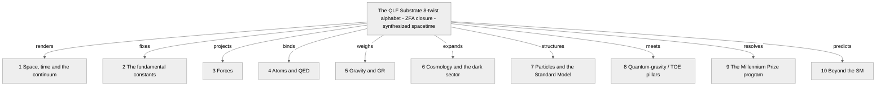

**Open:** [`README.md`](README.md)

Root reading: **everything derives from the 8-twist substrate under Zero Free Action** —
[`Philosophy.md`](Philosophy.md) (possibilist ontology), [`WHITE_PAPER.md`](WHITE_PAPER.md).

---

## 1. Space, time, and the continuum

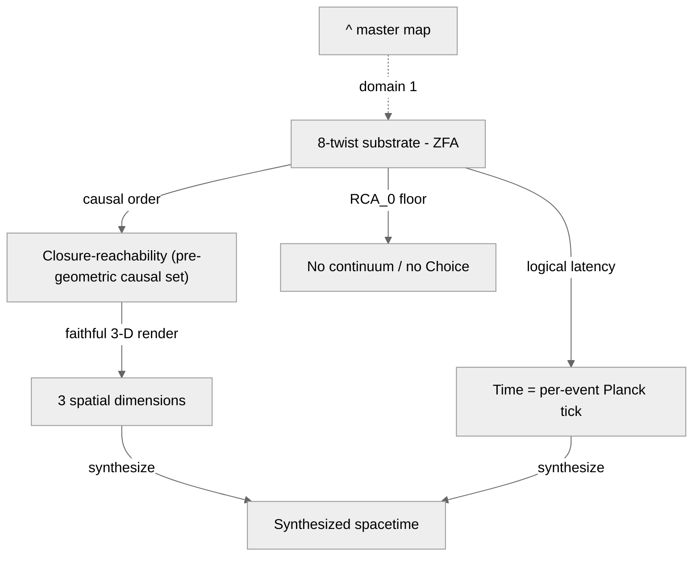

**Open:** [`README.md`](README.md) · [`SpaceTime.md`](SpaceTime.md) · [`TheContinuum.md`](TheContinuum.md)

`3` is the minimal dimension that renders any relational structure faithfully — and it reappears
everywhere below ([`SpaceTime.md`](SpaceTime.md) §3a).

---

## 2. The fundamental constants

The `6 spatial + 2 gauge` split (the `3` axes) fixes a family of constants. **α is the flagship.**

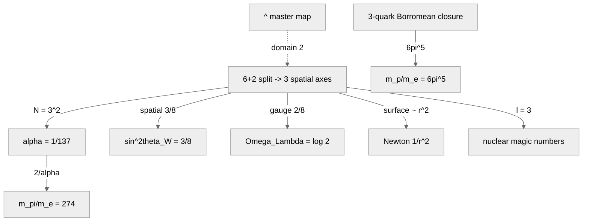

**Open:** [`SpaceTime.md`](SpaceTime.md) · [`Alpha.md`](Alpha.md) · [`Weak_Force.md`](Weak_Force.md) · [`Cosmological_Constant.md`](Cosmological_Constant.md) · [`Gravity_From_Delay.md`](Gravity_From_Delay.md) · [`Magic_numbers.md`](Magic_numbers.md) · [`Proton_Resonance_R_e.md`](Proton_Resonance_R_e.md) · [`Pion_QLF.md`](Pion_QLF.md)

**α's full story** (derivation, IR/3-D scale, the running, the no-drift theorem, 4D/5D
over-determination): [`Alpha.md`](Alpha.md).

---

## 3. Forces

One gauge-twist mechanism, seen from three projections of the 3-axis structure.

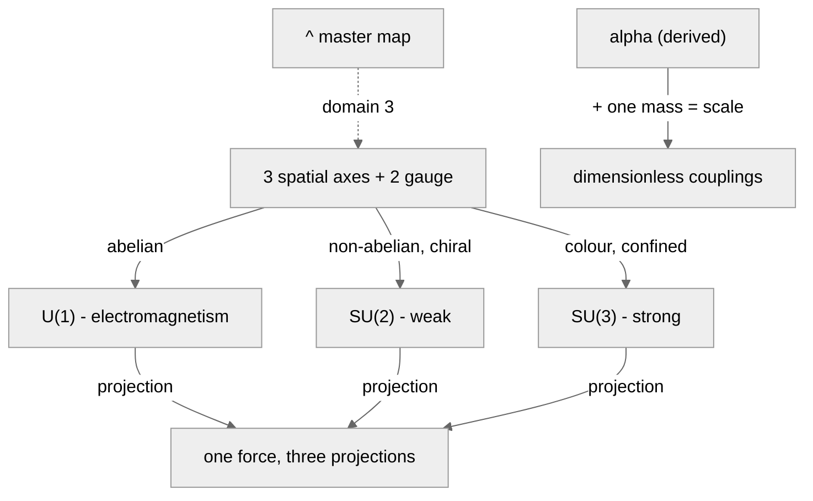

**Open:** [`Forces_From_Three_Axes.md`](Forces_From_Three_Axes.md) · [`Electricity.md`](Electricity.md) · [`Weak_Force.md`](Weak_Force.md) · [`Alpha.md`](Alpha.md) · [`Forces_From_Alpha.md`](Forces_From_Alpha.md)

---

## 4. Atoms and QED

Everything here is **downstream of the derived α** ([`Alpha.md`](Alpha.md) §10).

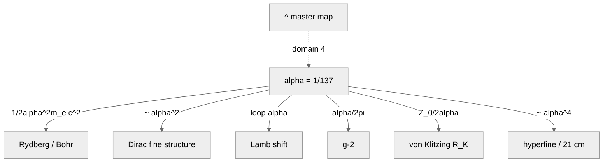

**Open:** [`Alpha.md`](Alpha.md) · [`Hydrogen.md`](Hydrogen.md) · [`Dirac_Correction.md`](Dirac_Correction.md) · [`Lamb_Shift.md`](Lamb_Shift.md) · [`g_minus_2.md`](g_minus_2.md) · [`Electricity.md`](Electricity.md) · [`Magnetism_Spatial_Dynamics.md`](Magnetism_Spatial_Dynamics.md)

---

## 5. Gravity and GR

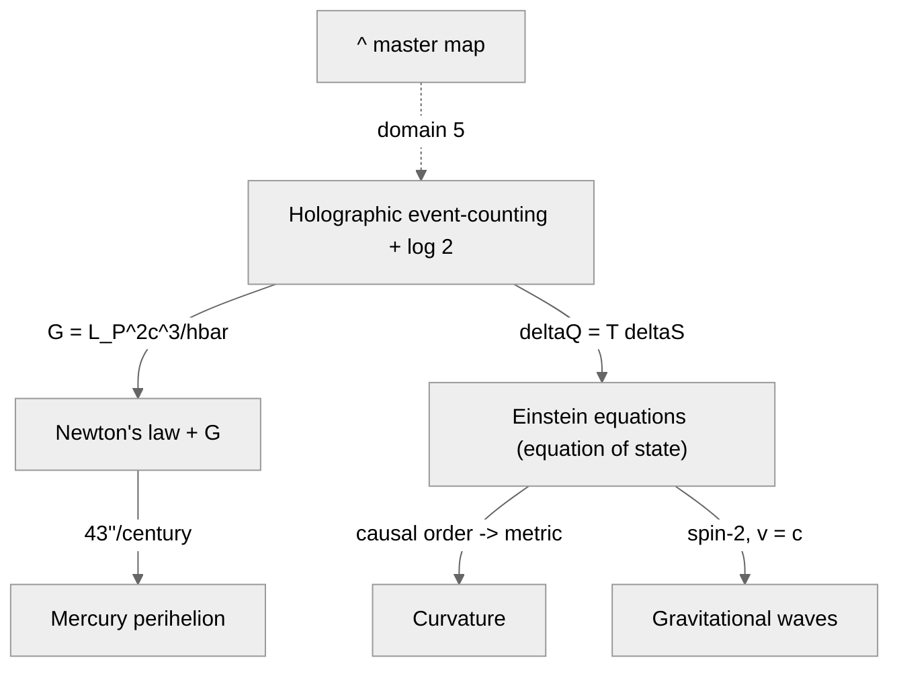

**Open:** [`Gravity_From_Delay.md`](Gravity_From_Delay.md) · [`Mercury_Perihelion.md`](Mercury_Perihelion.md) · [`Einstein_Equations.md`](Einstein_Equations.md) · [`Curvature.md`](Curvature.md)

---

## 6. Cosmology and the dark sector

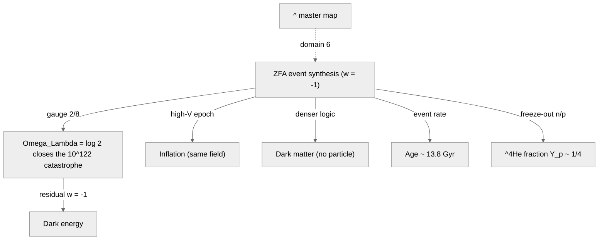

**Open:** [`Cosmological_Constant.md`](Cosmological_Constant.md) · [`Curvature.md`](Curvature.md) · [`DarkMatter.md`](DarkMatter.md) · [`AgeOfUniverse.md`](AgeOfUniverse.md) · [`Fusion.md`](Fusion.md)

---

## 7. Particles and the Standard Model

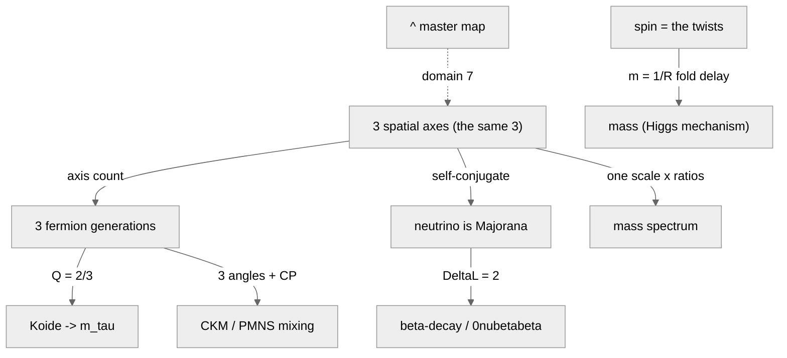

**Open:** [`Standard_Model.md`](Standard_Model.md) · [`Beta_Decay_Neutrino_Nature.md`](Beta_Decay_Neutrino_Nature.md) · [`Per_Qubit_Mass_Quantum.md`](Per_Qubit_Mass_Quantum.md) · [`Spin_QLF.md`](Spin_QLF.md) · [`Higgs.md`](Higgs.md)

---

## 8. Quantum-gravity / TOE pillars

QLF meets the three TOE-candidate programs — and reproduces their wins from the substrate.

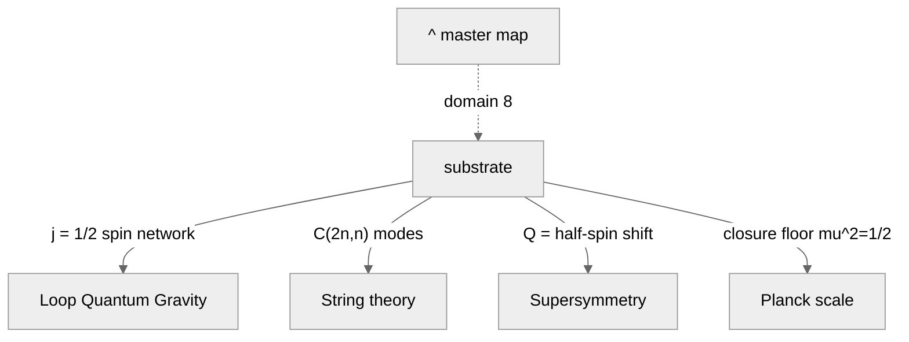

**Open:** [`README.md`](README.md) · [`LQG_QLF.md`](LQG_QLF.md) · [`StringTheory.md`](StringTheory.md) · [`SUSY_QLF.md`](SUSY_QLF.md) · [`Planck_Scale.md`](Planck_Scale.md)

---

## 9. The Millennium Prize program

The thesis: *the continuum and Choice are mathematics' UV catastrophe* — each problem = a constructive
RCA₀ core + one explicit continuum/Choice boundary axiom.

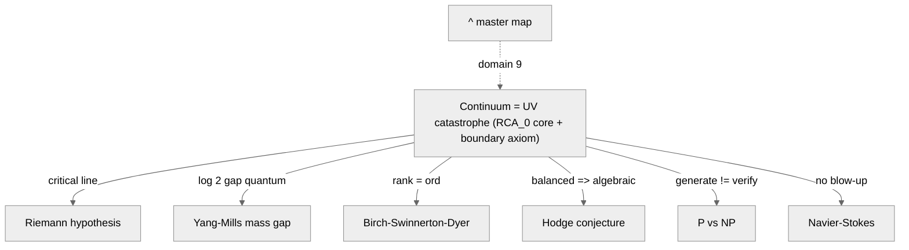

**Open:** [`Continuum_Choice_Fallacy.md`](Continuum_Choice_Fallacy.md) · [`Riemann-Conjecture-Proof.md`](Riemann-Conjecture-Proof.md) · [`YangMills_MassGap_QLF.md`](YangMills_MassGap_QLF.md) · [`BSD_QLF.md`](BSD_QLF.md) · [`Hodge_QLF.md`](Hodge_QLF.md) · [`P_vs_NP_QLF.md`](P_vs_NP_QLF.md) · [`NavierStokes_QLF.md`](NavierStokes_QLF.md)

Overview: [`Millennium.md`](Millennium.md).

---

## 10. Beyond the SM

What QLF derives that the SM treats as free input, and the falsifiable predictions it makes.

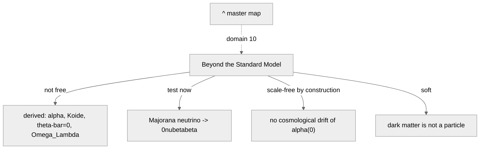

**Open:** [`Beyond_Standard_Model.md`](Beyond_Standard_Model.md) · [`Beta_Decay_Neutrino_Nature.md`](Beta_Decay_Neutrino_Nature.md) · [`Alpha.md`](Alpha.md) · [`DarkMatter.md`](DarkMatter.md)

---

## See also

- [`README.md`](README.md) · [`lean/README.md`](lean/README.md) — project overview + the 89-module Lean
  table.
- [`Open_Problems.md`](Open_Problems.md) — the honest gap registry (closed / principled-boundary / open).
- [`Beyond_Standard_Model.md`](Beyond_Standard_Model.md) — the derived / predicted / open scorecard.
- [`Alpha.md`](Alpha.md) — one result mapped end to end, as a worked example.
