# QLF Flow Chart — a visual map of the framework

> **This is a navigation map of the [Quantum Logical Framework (QLF)](README.md).** Every **box** links
> to the doc that derives it; every **connector is labelled** with the relationship it encodes; and each
> chart's **hub node links back to the master map**, so the ten charts form one navigable web. Diagrams
> render on GitHub (Mermaid) — click any node.

The taxonomy: **one substrate → ten domains → the individual results.**

---

## Master map — the substrate and its ten domains

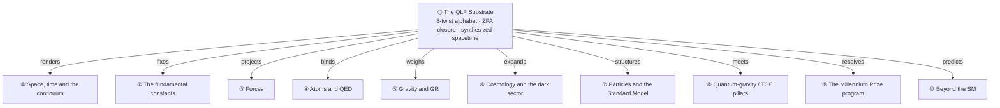

Root reading: **everything derives from the 8-twist substrate under Zero Free Action** —
[`Philosophy.md`](Philosophy.md) (possibilist ontology), [`WHITE_PAPER.md`](WHITE_PAPER.md).

---

## 1. Space, time, and the continuum

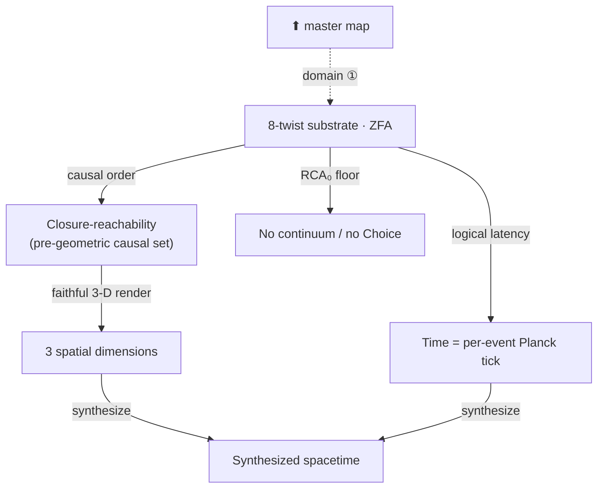

`3` is the minimal dimension that renders any relational structure faithfully — and it reappears
everywhere below ([`SpaceTime.md`](SpaceTime.md) §3a).

---

## 2. The fundamental constants

The `6 spatial + 2 gauge` split (the `3` axes) fixes a family of constants. **α is the flagship.**

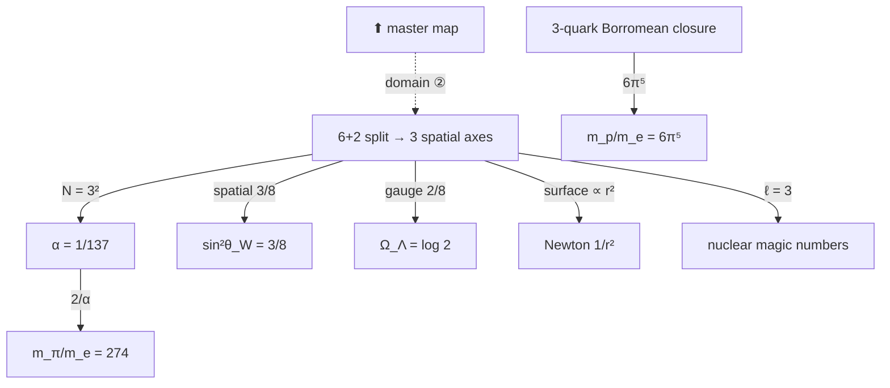

**α's full story** (derivation, IR/3-D scale, the running, the no-drift theorem, 4D/5D
over-determination): [`Alpha.md`](Alpha.md).

---

## 3. Forces

One gauge-twist mechanism, seen from three projections of the 3-axis structure.

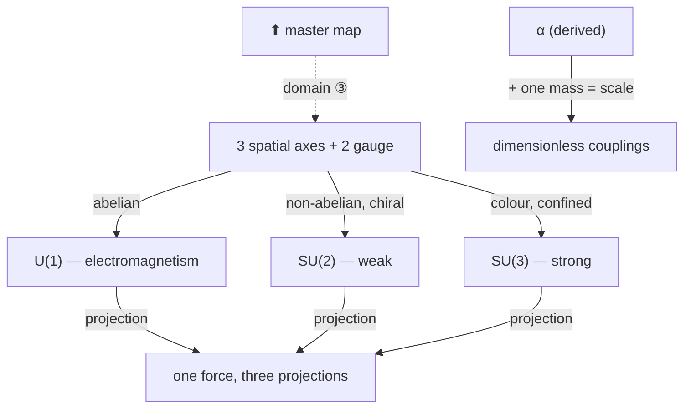

---

## 4. Atoms and QED

Everything here is **downstream of the derived α** ([`Alpha.md`](Alpha.md) §10).

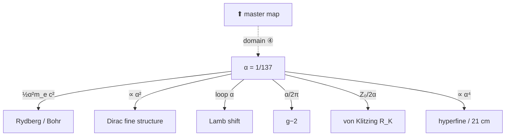

---

## 5. Gravity and GR

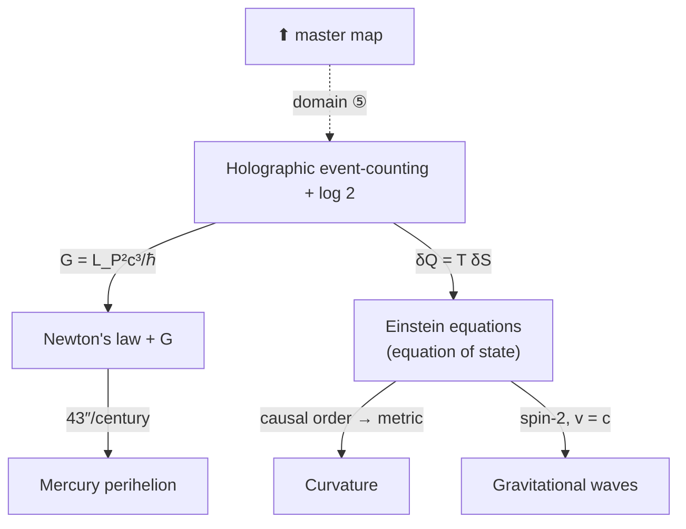

---

## 6. Cosmology and the dark sector

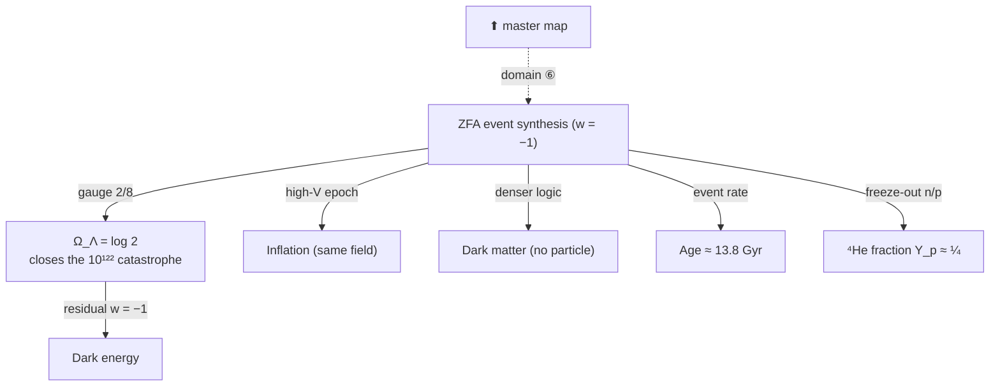

---

## 7. Particles and the Standard Model

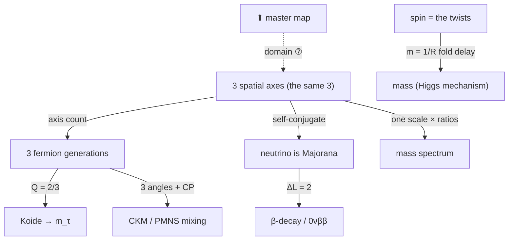

---

## 8. Quantum-gravity / TOE pillars

QLF meets the three TOE-candidate programs — and reproduces their wins from the substrate.

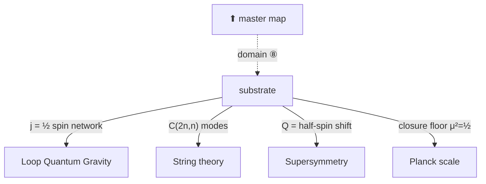

---

## 9. The Millennium Prize program

The thesis: *the continuum and Choice are mathematics' UV catastrophe* — each problem = a constructive
RCA₀ core + one explicit continuum/Choice boundary axiom.

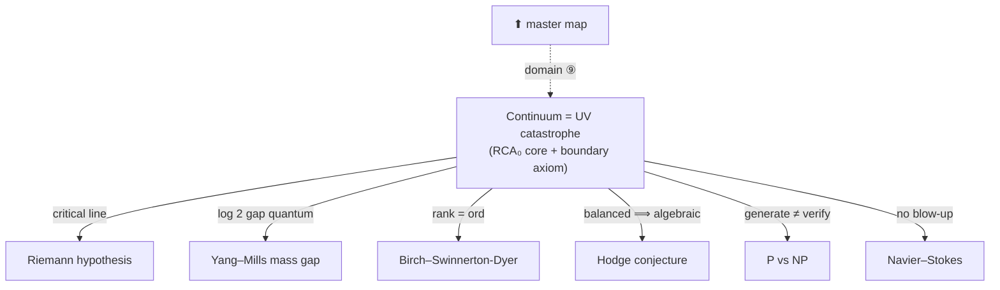

Overview: [`Millennium.md`](Millennium.md).

---

## 10. Beyond the SM

What QLF derives that the SM treats as free input, and the falsifiable predictions it makes.

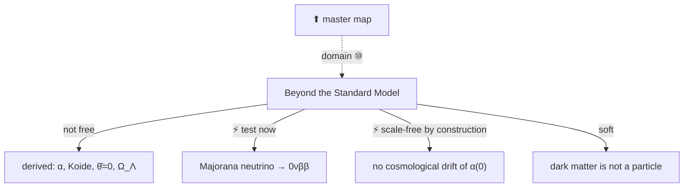

---

## See also

- [`README.md`](README.md) · [`lean/README.md`](lean/README.md) — project overview + the 89-module Lean
  table.
- [`Open_Problems.md`](Open_Problems.md) — the honest gap registry (closed / principled-boundary / open).
- [`Beyond_Standard_Model.md`](Beyond_Standard_Model.md) — the derived / predicted / open scorecard.
- [`Alpha.md`](Alpha.md) — one result mapped end to end, as a worked example.
