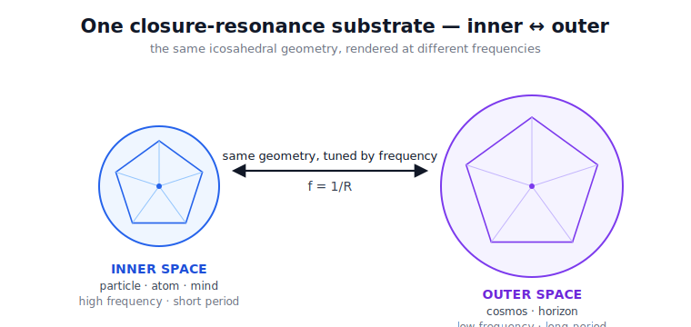
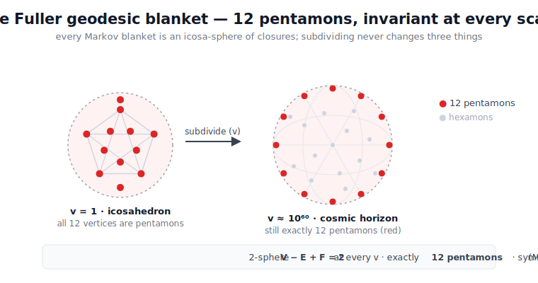
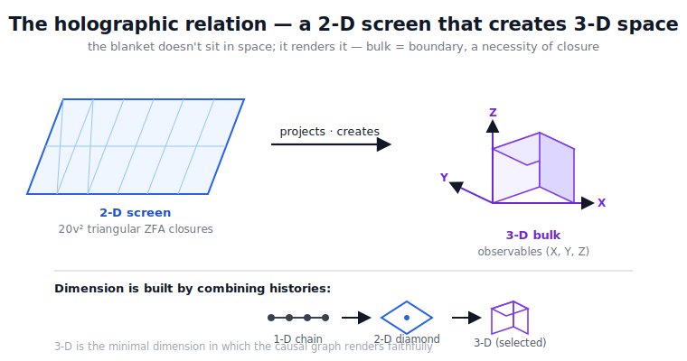
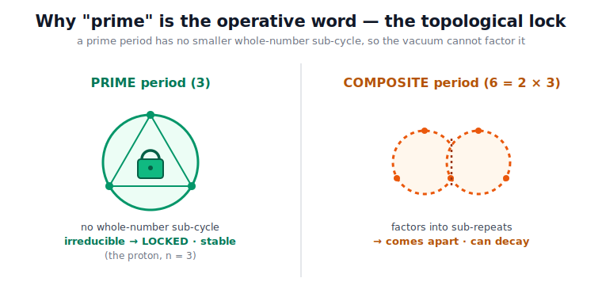
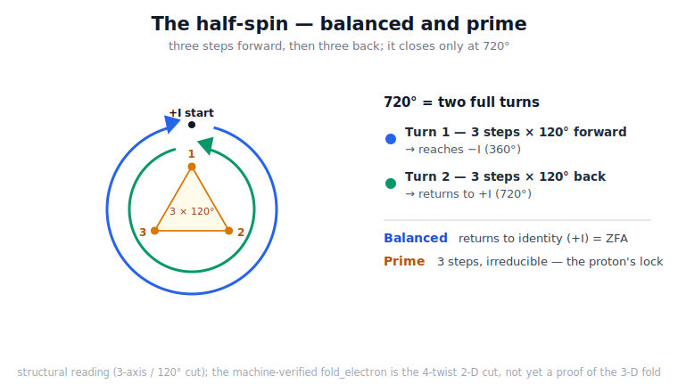

# The geometry of inner and outer space — polygons, prime frequencies, crystals

A synthesis in the [Quantum Logical Framework](README.md) (QLF). Inner space (a particle, an atom, a
mind) and outer space (the cosmos) are not two arenas — they are **one closure-resonance substrate**,
rendered at different frequencies. The same icosahedral geodesic-blanket geometry, the same prime
frequencies, the same census `C(2n,n)`, organize both. The organizing principle: **the highest-frequency
resonant closure dominates the rendering** — and the irreducible dominants are the *prime* frequencies.

Most of the geometry below is machine-verified; the new Lean anchor is
[`lean/QLF_PrimeResonance.lean`](lean/QLF_PrimeResonance.lean) (prime topology stability + the half-spin
keystone). The *dynamics* of this geometry — angular momentum as circulation, vorticity, and the
Navier–Stokes no-blow-up — are [`Navier_Stokes_Geometry.md`](Navier_Stokes_Geometry.md).

*The organizing thesis: inner and outer space are not two arenas but one substrate, the same icosahedral geometry tuned by frequency.*

---

## 1. One geometry at every scale — the Fuller geodesic blanket

Every Markov blanket is a **geodesic icosa-sphere** of ZFA closures — machine-verified in
[`lean/QLF_PrimordialMarkovBlanket.lean`](lean/QLF_PrimordialMarkovBlanket.lean) ([`Primordial_Markov_Blankets.md`](Primordial_Markov_Blankets.md)):

- `primordial_blanket_vertex_count v = 10v²+2`, `edge = 30v²`, `face = 20v²` (Fuller frequency-`v`
  subdivision; `base_icosahedron` = 12/30/20),
- `primordial_blanket_euler` — `V − E + F = 2` at **every** frequency `v` (a topological 2-sphere
  always),
- `pentamons_invariant` — exactly **12** five-valent vertices, *scale-invariant*: the same 12 at the
  `v=1` icosahedron and at the `v ≈ 6.7×10⁶⁰` cosmic horizon — the irreducible curvature signature,
- `mckay_2I_E8_anchor` — the closure-symmetry group is the binary icosahedral `2I` (order 120), McKay-
  dual to **E₈** (dimension 248). E₈ is not chosen; it *falls out* of the substrate's native symmetry.

So inner and outer space are the **same polygonal closure geometry** at different `v`. Geometry is
*synthesized* (the blanket renders it), not a fixed backdrop.

## 1b. 2D blanket, 3D bulk — a surface that *creates* space

The blanket is a **2-D** geodesic surface — polygons / triangular ZFA closures tile it (`20v²` faces),
the holographic **screen**. It renders the **3-D** bulk: *a geodesic sphere isn't a shape in space, it
creates space*. The 2-component closure state projects to 3-D observables `(X,Y,Z)` with a 1-D boundary
phase ([`Holographic.md`](Holographic.md)); the 2D↔3D relation **is** the holographic principle (bulk =
boundary, a topological necessity of closure).

And dimension is *built by combining histories* — the verified ladder **1-D chain → 2-D causal diamond →
3-D** ([`Einstein_Equations.md`](Einstein_Equations.md) §6a: `QLF_CausalInterval`/`QLF_CausalDimension`,
the curvature rungs), with **3-D selected** as the minimal dimension in which a relational/causal graph
renders faithfully ([`SpaceTime.md`](SpaceTime.md) §3a; `QLF_Generations`; the magic numbers,
[`Magic_numbers.md`](Magic_numbers.md)). So "2D and 3D" is the one blanket read two ways: the polygonal
screen and the bulk it synthesizes.

**Where time fits — the off-shelf 4th.** Time is *not* a fourth spatial axis: it is the **gauge-fold /
closure direction**, synthesized as `f = 1/t` ([`ZFAEventDynamics`](lean/ZFAEventDynamics.lean)). The
8-twist alphabet splits **6 + 2** — the **6 spatial twists** are the 3 axis-pairs (the 3 spatial
dimensions), and the **2 gauge twists** (the `±` fold) make time (the closure rate, the constructing
delay `Δt = R/f`) plus the `U(1)` charge. So spacetime is **3 + 1**: in the causal-set ladder the 1-D
chain is a *worldline (time)* and the 2-D diamond is *1 space + 1 time*, so reaching the 3 spatial axes
is `3 + 1 = 4-D` — with the **4th dimension (time) taken off the shelf** as the synthesized gauge/closure
direction, leaving the 3 spatial dimensions we render as space.

## 2. Crystals — the blanket geometry extended into ordered matter

A crystal is a **macroscopic resonant closure lattice** ([`Crystal_QuantumOS.md`](Crystal_QuantumOS.md),
[`Emergent_Markov_Blankets.md`](Emergent_Markov_Blankets.md)). Quiet-frequency rare-earth and defect
modes (e.g. `¹⁵¹Eu³⁺:Y₂SiO₅`, six-hour ground-state coherence) are **deep Markov blankets** — narrow
linewidth + suppressed bath coupling = the `Δt = R/f` isolation of a deep blanket. Resonating atom
groups self-organize into ZFA-closed logical qubits. **Perfect pitch** is the cleanest case where the
structure *is* frequency — an absolute resonance lock. The crystal is the polygon geometry of §1 carried
up into ordered matter.

## 3. Prime frequencies — the irreducible modes

A resonant closure has a frequency `f = 1/R` (period `R`). A **prime** frequency is one whose period is
prime — and prime frequencies are *irreducible*: a prime-period closure has **no** nontrivial sub-closure
repeat (`prime_freq_irreducible`: the only divisors of a prime `R` are `1` and `R`). So the vacuum's
Zeno-pruning cannot factor it into a whole-number repeat of a shorter stable closure — a **topological
lock** ([`Prime_Topology_Stability.md`](Prime_Topology_Stability.md)). The proton (`n=3` Borromean) is
stable for exactly this reason; composite-period closures factor and can decay (`composite_freq_factors`).

The prime ↔ frequency tie runs through the substrate census: `is_resonant_generation` — a generation
*resonates* iff a ZFA-stable closure survives, "corresponding to a zeta zero" (`QLF_QuCalc`); the stable
count is `closure_census = C(2n,n)` (`QLF_PhysicalPi`), and the same `C(2n,n)` is the gap-zero density
`~1/√(πn)` ([`SpectralGap.md`](SpectralGap.md)). One census ties **primes ↔ π ↔ ζ**. Pythagoras's "music
of the spheres" is the ZFA harmonic-closure condition ([`GodCreatedTheIntegers.md`](GodCreatedTheIntegers.md)).

## 3b. The half-spin is the prime-3 keystone — *balanced and prime*

The deepest instance: the fundamental fermion itself. A half-spin closes only at **720°** —
machine-verified `rotation_720_eq_id` (two 360° turns), with one turn giving only `−I`
(`rotation_360_eq_negI`). Read each 360° turn as **3 steps of 120°** — the Koide three-phase (`koide_three_phase`),
the 3 axes / 3 generations / `S₃` (`num_generations_eq_three`). Then the half-spin is **3 steps forward
(first turn) + 3 steps back (the second turn that returns `−I·−I = +I`)**:

> **Caption (read against the verified-vs-reading table):** this diagram shows the **3-axis / 120° (3-D) reading** of the half-spin. What is *machine-verified* is the step-count algebra (`half_spin_prime`, `half_spin_balanced_steps`, `half_spin_irreducible`) and the 720° closure (`rotation_720_eq_id`); the **3-D fold itself is not yet proven** — the verified `fold_electron` is the 4-twist 2-D (x–y square) cut of the same object.

- **Balanced** — the forward path plus its Hermitian-conjugate / time-reverse "back" (the dagger,
  `eval_dagger`, the reversibility capstone) close to identity: ZFA.
- **Prime** — 3 steps per turn, and `3` is prime (`half_spin_prime`), so the turn is *irreducible*
  (`half_spin_irreducible`): the **same vacuum-proof prime-lock as the proton `n=3`**, now at the
  fundamental fermion.

So prime-`3` is the **keystone of all stable matter** — fermion and proton alike — unifying half-spin ↔
proton `n=3` ↔ Koide 120°×3 ↔ 3 axes / generations / `S₃` ↔ forward/back in time (the dagger) ↔ the 720°
double cover. *Balanced and prime* = ZFA (balanced) **and** irreducible (prime) — the two conditions for
a stable fundamental closure.

**Honest reconciliation:** the verified `fold_electron` is currently the 4-twist x–y *square* (→ `−I`);
the 3-forward-3-back is the deeper 3-axis / 120° (3-D) cut of the same 720° object — a structural model
the prime-step-count facts anchor, *not yet a proof* of the 3-D fold. See `QLF_PrimeResonance`'s honest
scope.

## 3c. Orthogonality is one bit — the prime ladder (2, 3, 5, 7, …)

The prime-3 proton is one rung. The deeper statement is general: **orthogonality is the one-bit
resolution of the rendered perspective, and the prime arrangements are the substrate's irreducible
structure.**

**Orthogonality is one bit.** Two states are orthogonal exactly when they are perfectly distinguishable —
one bit. In the substrate that bit is concrete: the Hermitian-conjugate pair `(t, t†)` is a binary
partition whose ZFA closure carries exactly `log 2` nats — one bit (`orthogonal_distinction_is_one_bit`,
reusing `zfa_closure_minimizes_free_energy`, [`QLF_FreeEnergy`](lean/QLF_FreeEnergy.lean)). The three
mutually-orthogonal spatial axes (`su2_comm_*`, [`QLF_Spin`](lean/QLF_Spin.lean)) are three one-bit
distinctions, so the rendered **3-D perspective *is* the geometry seen at one-bit-per-axis resolution**.
The orthogonal / periodic-lattice description — and the crystallographic restriction that allows only 2-,
3-, 4-, 6-fold axes — is therefore a *low-resolution rendering*, the coarse floor. It is not where the
structure lives.

**The structure lives in the primes.** Every closure period factors; a **prime** period has no
nontrivial sub-closure repeat (`prime_freq_irreducible` — the irreducible lock), and a composite one
decomposes (`composite_freq_factors`). So the irreducible building blocks of the geometry are the prime
arrangements, and they are general — not a 5-fold special case. Each small prime has a home in QLF, but
**the *kind* of role shifts up the ladder**, and honesty requires saying so:

| Prime | Role | Where (anchored) |
|---|---|---|
| **2** | the bit itself — spin, the Hermitian pair, the `log 2` quantum | `orthogonal_distinction_is_one_bit`; orthogonality *is* this 2 |
| **3** | *geometric symmetry* — 3 spatial axes / proton `n=3` / colour SU(3) / 3 generations / Koide | `half_spin_irreducible`, §3b; `QLF_Generations` |
| **5** | *geometric symmetry* — icosahedral 5-fold / 12 pentamons / `I ≅ A₅`; densest **local** packing ⟹ common (clusters, viruses, quasicrystals) | `prime_five_irreducible`, `five_divides_icosahedral` (`5 ∣ \|2I\|=120`) |
| **7** | *a derived count, NOT a 7-fold symmetry* — QCD `b₀ = 11·3/3 − 2·6/3 = 7`, the `14π=2π·7` hierarchy | `prime_seven_is_qcd_b0` (reuse `beta_coefficient_eq_seven`); [`QLF_BetaFunction`](lean/QLF_BetaFunction.lean) |
| **11, 13, …** | open — locks (`prime_freq_irreducible`) with no anchored geometric/physical role yet | — |

**Prime-5 is common, not exceptional** — and this is what corrects the naive "5-fold is forbidden"
reflex. The crystallographic restriction forbids 5-fold *for an orthogonal, periodic lattice* — i.e. at
the one-bit-lattice floor. Above that floor, icosahedral 5-fold is the densest **local** packing (Frank
1952), so it is everywhere local order dominates: atomic clusters, virus capsids, quasicrystals, and the
substrate's **universal 12 pentamons** at every Fuller frequency (`pentamons_invariant`). Its macroscopic
rendering is the quasicrystalline / Penrose tiling. The "5" reaches into atomic structure too: the
d-subshell (`ℓ=2`, `2ℓ+1 = 5` orbitals) is the **5-dimensional irreducible representation of `A₅`** (whose
irreps are `{1,3,3,4,5}`; the unsplit `H_g` multiplet), so "5D atomic structure" (the 5 d-orbitals) and
the icosahedral 5-fold are the *same representation* — and `5` is a McKay mark of `2I → E₈`.

**What is verified vs a reading (the distinct-primes discipline).** Verified: orthogonality carries one
bit (`log 2`); `2,3,5,7` are prime; prime periods are irreducible locks; `5 ∣ \|2I\|`; `b₀ = 7`. Readings
and cited facts: that orthogonality is the "rendered-perspective resolution" (a QLF interpretation); that
prime-5 is "common" (cited — icosahedral packing, quasicrystals); the d-orbital `ℓ=2` ↔ 5-dim `A₅` irrep
(**standard group theory, cited — a shared representation, *not* a QLF derivation of atomic structure**;
QLF's native shell model is the 3-D oscillator, [`Magic_numbers.md`](Magic_numbers.md)). And the several
"fives" are **different objects** — keep them apart: the 5-fold *symmetry* (pentamons, `A₅` axes), the
5-*dimensional* irrep (d-orbitals), the Banach–Tarski 5 *pieces* (`1+2×2` from `F₂`'s 2 generators,
[`Banach_Tarski_QLF.md`](Banach_Tarski_QLF.md)), and the Borromean `5 = 3+2` angular *DOF*
(`total_angular_DOF_eq_five`, behind `m_p/m_e = |S₃|·π⁵`) are not one thing. Likewise `b₀ = 7` is a count,
not a heptagonal symmetry. Asserting only the genuine identities — and refusing the rest — is what keeps
this a structure and not a numerology. Anchored in [`QLF_PrimeResonance`](lean/QLF_PrimeResonance.lean);
no new axioms.

## 4. Higher frequencies dominate

Among co-present resonant closures, the **highest-frequency (shortest-period) one dominates the
rendering** — `higher_freq_dominates` (shorter period ⟹ higher frequency, reusing
[`Consciousness.md`](Consciousness.md)'s `freq R = 1/R`). Inner: it is the **conscious content** (the
`consciousPeriod = min period` argmax). Outer: the finest closure sets the geometry's resolution and the
dominant structure. The most stable dominants are the high *prime* frequencies — irreducible **and**
fastest.

## 5. The cosmic exception — quieting to receive the low

"Higher dominates" is the **default**. Cosmic / meditative consciousness is the deliberate **override**:
quiet the dominant high internal frequencies so a faint **low-frequency external joint closure** can be
received (`quieting_shifts_to_external`, the de Sitter cosmic-horizon blanket, `Ω_Λ = log 2`). The
default rule and the receiver exception are two readings of the same argmax — see
[`Consciousness.md`](Consciousness.md) §4.

## 6. Inner ↔ outer duality

Both inner and outer space are **renderings of one closure-resonance substrate**; the bridge is
frequency / resonance. The same icosahedral E₈ symmetry organizes both; the same census `C(2n,n)` ties
the primes, π and ζ that structure them; the Lorentz boost between two frames is just the *ratio of their
internal frequencies* ([`Cross_Frequency_Lorentz.md`](Cross_Frequency_Lorentz.md)). The geometry of inner
space and the geometry of outer space are the same geometry, tuned.

---

## What is verified vs. a reading

| Claim | Status |
|---|---|
| Fuller blanket V/E/F, Euler χ=2, 12 pentamons, McKay/E₈ | ✅ Lean (`QLF_PrimordialMarkovBlanket`) |
| 2D screen ↔ 3D bulk (holography); 1D→2D→3D dimension ladder; 3D selected | ✅ Lean (`QLF_CausalInterval`/`Dimension`, `QLF_Generations`) + `Holographic.md` reading |
| Prime frequencies irreducible (the lock); composites factor | ✅ Lean (`prime_freq_irreducible`, `composite_freq_factors`) |
| Higher frequencies dominate | ✅ Lean (`higher_freq_dominates`, `consciousPeriod`) |
| Half-spin = balanced + prime (3 forward + 3 back) | ✅ step-count facts Lean (`half_spin_*`); the 3-axis/120° 3-D fold is a reading (verified `fold_electron` is the 4-twist 2-D cut) |
| Crystals as resonant closure lattices | Structural/engineering reading (`Crystal_QuantumOS.md`) |
| Prime ↔ π ↔ ζ via `C(2n,n)` | Shared census (a structural resonance), **not** a proof of RH |

See also: [`Primordial_Markov_Blankets.md`](Primordial_Markov_Blankets.md),
[`Crystal_QuantumOS.md`](Crystal_QuantumOS.md), [`Prime_Topology_Stability.md`](Prime_Topology_Stability.md),
[`Frequency_Synchronization.md`](Frequency_Synchronization.md), [`Consciousness.md`](Consciousness.md),
[`Physical_Pi.md`](Physical_Pi.md), [`SpectralGap.md`](SpectralGap.md), [`Spin_QLF.md`](Spin_QLF.md).
