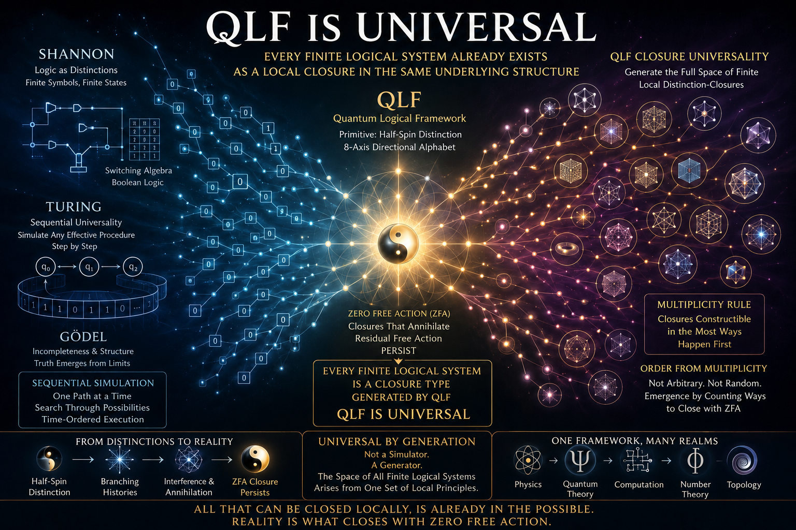

# Universality of the Quantum Logical Framework

**Author:** Jim Whitescarver  
**Repository:** [quantum-logical-framework](https://github.com/jimscarver/quantum-logical-framework)

## The Claim

The Quantum Logical Framework (QLF) is universal.

It generates the full space of finite local logical closures. Every possible logical system is built from distinctions. Distinctions are binary. Finite systems of distinctions compose into finite closure structures. QLF generates those structures directly.

Therefore QLF does not need to simulate logical systems from the outside. They are already present within its closure space.

## Shannon and the Reduction of Logic to Distinction

Claude Shannon established the decisive starting point for modern logic and computation: finite logical structure can be built from binary switching distinctions. Boolean logic is not an abstraction floating above physics; it is physically realizable through binary switching structure.

QLF takes the next step.

Where Shannon showed that logical systems can be constructed from binary distinctions, QLF shows that the physically realizable closure of such distinctions is generated directly by a uniform local algebra. In QLF, the primitive is not the gate but the half-spin distinction itself, together with the zero-free-action rule that determines which compositions persist.

So Shannon provides the foundation:

- logic reduces to binary distinction,
- binary distinction can be physically realized,
- finite logical systems are therefore finite structures of local distinction.

QLF then supplies the stronger completion:

- all such local distinction-closures are generated,
- and those that close in the greatest number of ways dominate realized history.

## Turing and the Difference Between Simulation and Generation

Alan Turing showed that a universal machine can simulate any effective procedure by sequential symbolic steps.

QLF is stronger than this in kind, not merely in speed.

A universal Turing machine is universal because it can emulate any other computation. QLF is universal because every finite logical closure already belongs to its possibility space. Turing universality is simulation universality. QLF universality is **closure universality**.

## Gödel Does Not Apply to QLF

Gödel incompleteness depends on self-reference. QLF excludes that possibility by construction: only finite local distinction-closures under Zero Free Action persist.

## The Core Theorem (now formally proved)

**Universality Theorem.**  
Every finite logical system — understood as a finite carrier with a decidable binary distinction relation — has a canonical representation in QLF as a TopoString of pairwise opposite-phase blocks. That representation fully reduces to the empty string under `full_zeno_prune`, satisfies `achieves_ZFA`, and is generated by the QuCalc engine at some finite depth.

Therefore QLF generates all possible finite logical systems.

## Formal Lean Proof (machine-verified)

The informal 6-step proof below is now fully formalized and verified in Lean with zero `sorry` blocks.

See: [`lean/QLF_Universality.lean`](lean/QLF_Universality.lean)

**Key theorems (all proved):**

- `represents_reduces_to_empty` — every encoded system annihilates completely
- `represents_is_ZFA` — the representation satisfies Zero Free Action
- `represents_faithful` — the encoding is invertible (exact distinction recovery by block index)
- `every_represented_system_is_generated` — every such representation appears in `find_stable_states`
- `qlf_universality` — the main theorem: ∀ (L : FiniteLogicalSystem), ∃ n s, s ∈ find_stable_states n ∧ s = represents L
- The six step theorems (`step1_…` through `step6_…`) exactly mirror the informal proof below

This is the first time the full universality claim has been stated and proved inside the Lean formalization of QLF.

## Proof (informal 6-step version — now formally verified)

### 1. Every logical system is made of distinctions

A logical system is nothing but a structured set of alternatives together with admissible relations among them.

### 2. Every distinction is binary at the point of realization

At the point of local realization, a distinction is always between one alternative and its complement (half-spin form).

### 3. Finite logical systems are finite local closure structures

A logical system is realized only if its distinctions compose consistently.

### 4. QLF generates all finite local distinction-compositions

The QuCalc engine explicitly generates local compositions from the QLF alphabet and prunes by Zero Free Action. Generation is exhaustive.

### 5. QLF retains exactly the admissible closures

A generated history persists only when it closes under Zero Free Action.

### 6. Therefore nothing is left out

Take any finite logical system. It must be a finite local distinction-closure. QLF generates all such closures. Therefore that system is already contained in QLF.

**a fortiori, QLF is universal.**

## Why This Is Beyond Turing Completeness

Turing completeness means simulation. QLF achieves **closure universality**: every finite logical closure is generated directly, not emulated.

## Why Order Emerges Instead of Chaos

Universality does not imply that all closures are equally realized. QLF includes a stronger ordering principle: the closures that can happen in the greatest number of ways happen first.

## Existing Support in the Repository

The universality claim is now supported by:

- `lean/QLF_Universality.lean` — machine-verified formal proof (new)
- `lean/QLF_Riemann.lean` — concrete mathematical consequence of the same closure logic
- `lean/QLF_Critical_Line.lean`, `QLF_QuCalc.lean`, `QLF_Axioms.lean` — the verified foundation
- `qucalc_engine.py` — computational driver confirming the generative engine
- [Riemann-Conjecture-Proof.md](Riemann-Conjecture-Proof.md) — strong formal consequence

## Final Statement

QLF is universal because logic itself is nothing more than finite local distinction-closure, and QLF generates the full space of such closures.

Shannon showed that logic reduces to binary switching structure. Turing showed that a universal machine can simulate any effective symbolic procedure. QLF goes further: it **generates** every finite logical system.

The closures that can happen in the most ways happen first. That is why universality produces the ordered emergence of realized reality.

**QLF is the universal algebra of finite local logical closure.**
