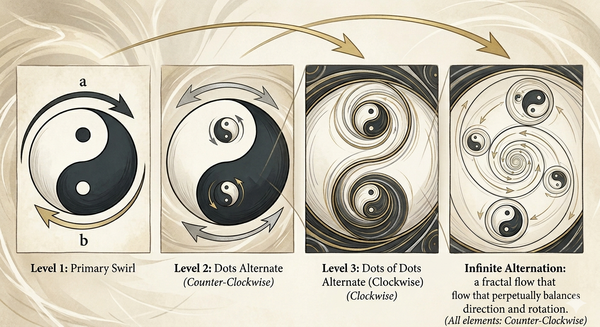

# Recursive Phase Logic: Folding Quantum Logical Action

This document presents `YinYangYin.png` as a **visual shorthand** for recursive folding of quantum logical action in the **Quantum Logical Framework (QLF)**.

## 1. Discrete Folding of Action

The image illustrates recursive alternation of complementary logical rotations:

- **Clockwise / Counter-clockwise**: represent successive complementary phases in Hilbert space.
- **Nested Dots**: indicate further recursive folding at smaller scales.
- **Self-similar repetition**: conveys recursion and logical closure.

Each level corresponds to a **Logical Fold**: a discrete, non-commutative operation that preserves zero-free-action balance.

## 2. Conceptual Role

`YinYangYin.png` is a **simplified, topological view** of folding quantum logical action:

- Shows how local complementary relations propagate through recursive structures.
- Highlights that persistence requires alternating, balanced operations.
- Provides an **intuitive guide** to the structure of the framework without replacing formal definitions or simulations.

## 3. Takeaway

The diagram is a **heuristic tool**: it simplifies the visualization of recursive logical folding in QLF.  
It **does not** attempt to be a literal physical derivation, but it captures the essence of how zero-free-action constraints organize persistent quantum-logical structure.
