# QLF Flow Chart — a visual map of the framework

> **This is a navigation map of the [Quantum Logical Framework (QLF)](README.md)** — one substrate, four
> families, ten domains, and the documents that derive each. The **Jump to** and **Open** links are the
> navigation; the visual diagrams live in the rendered version linked below.

The taxonomy: **one substrate → four domain families → ten domains → the individual results.**

---

## Master map — the substrate and its ten domains

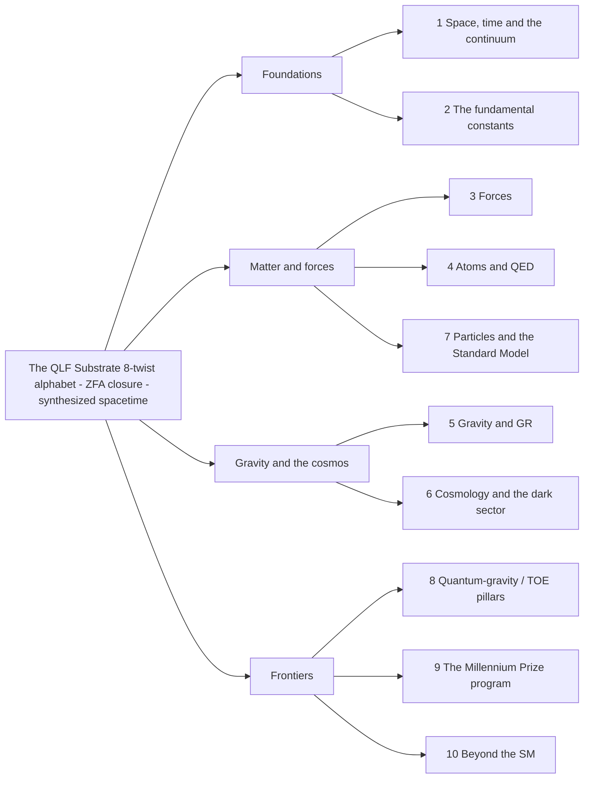

**Jump to:** [1 Space, time and the continuum](#1-space-time-and-the-continuum) &middot; [2 The fundamental constants](#2-the-fundamental-constants) &middot; [3 Forces](#3-forces) &middot; [4 Atoms and QED](#4-atoms-and-qed) &middot; [5 Gravity and GR](#5-gravity-and-gr) &middot; [6 Cosmology and the dark sector](#6-cosmology-and-the-dark-sector) &middot; [7 Particles and the Standard Model](#7-particles-and-the-standard-model) &middot; [8 Quantum-gravity / TOE pillars](#8-quantum-gravity--toe-pillars) &middot; [9 The Millennium Prize program](#9-the-millennium-prize-program) &middot; [10 Beyond the SM](#10-beyond-the-sm)

The four families: **Foundations** (1-2) &middot; **Matter and forces** (3, 4, 7) &middot; **Gravity and the cosmos** (5-6) &middot; **Frontiers** (8-10).

**Open:** [`README.md`](README.md)

Root reading: **everything derives from the 8-twist substrate under Zero Free Action** —
[`Philosophy.md`](Philosophy.md) (possibilist ontology), [`WHITE_PAPER.md`](WHITE_PAPER.md).

**Harmonic-closure model:** reality and constructable truth are the *closing spectrum* of frequency-component closures — each frequency `f = 1/R` is one ZFA closure, i.e. a quantum-logical **computation** (a set of Feynman diagrams: path integral = generate, ZFA closure = the firebreak selecting the physical ones) ([`Frequency_Synchronization.md`](Frequency_Synchronization.md) §0).

---

## 1. Space, time, and the continuum

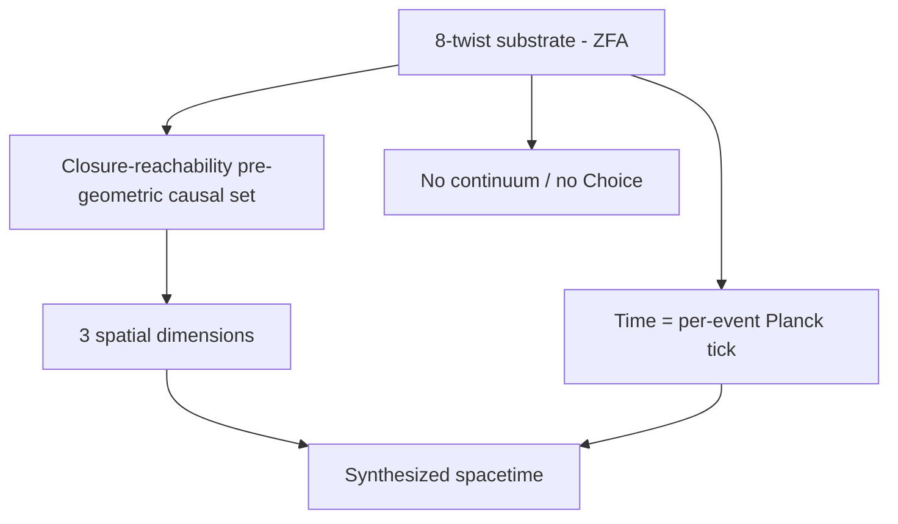

**Connectors:** *causal order* &rarr; Closure-reachability (pre-geometric causal s… &middot; *faithful 3-D render* &rarr; 3 spatial dimensions &middot; *logical latency* &rarr; Time = per-event Planck tick &middot; *synthesize* &rarr; Synthesized spacetime &middot; *RCA_0 floor* &rarr; No continuum / no Choice

**Open:** [`README.md`](README.md) · [`SpaceTime.md`](SpaceTime.md) · [`TheContinuum.md`](TheContinuum.md)

`3` is the minimal dimension that renders any relational structure faithfully — and it reappears
everywhere below ([`SpaceTime.md`](SpaceTime.md) §3a).

---

## 2. The fundamental constants

The `6 spatial + 2 gauge` split (the `3` axes) fixes a family of constants. **α is the flagship.**

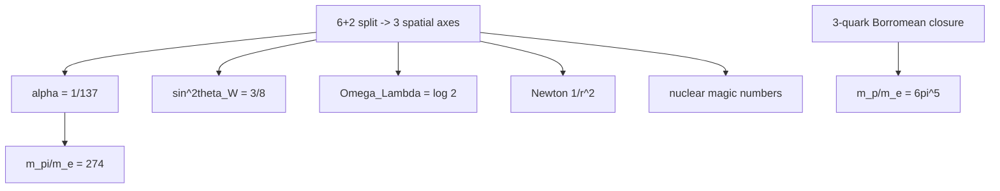

**Connectors:** *N = 3^2* &rarr; alpha = 1/137 &middot; *spatial 3/8* &rarr; sin^2theta_W = 3/8 &middot; *gauge 2/8* &rarr; Omega_Lambda = log 2 &middot; *surface ~ r^2* &rarr; Newton 1/r^2 &middot; *l = 3* &rarr; nuclear magic numbers &middot; *6pi^5* &rarr; m_p/m_e = 6pi^5 &middot; *2/alpha* &rarr; m_pi/m_e = 274

**Open:** [`SpaceTime.md`](SpaceTime.md) · [`Alpha.md`](Alpha.md) · [`Weak_Force.md`](Weak_Force.md) · [`Cosmological_Constant.md`](Cosmological_Constant.md) · [`Gravity_From_Delay.md`](Gravity_From_Delay.md) · [`Magic_numbers.md`](Magic_numbers.md) · [`Proton_Resonance_R_e.md`](Proton_Resonance_R_e.md) · [`Pion_QLF.md`](Pion_QLF.md) · [`Genesis.md`](Genesis.md)

The census spectrum explorer [`Genesis.md`](Genesis.md) exercises the constants sector end-to-end: the exact `−p/2` census spectral exponent (Lean-anchored, `QLF_CensusWalk`), census → π, and `α⁻¹ = 128 + d²` (`d = 3 → 137`).

**α's full story** (derivation, IR/3-D scale, the running, the no-drift theorem, 4D/5D
over-determination): [`Alpha.md`](Alpha.md).

---

## 3. Forces

One gauge-twist mechanism, seen from three projections of the 3-axis structure.

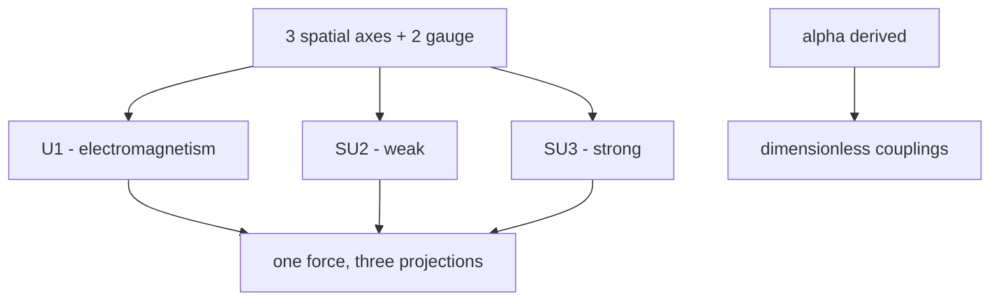

**Connectors:** *abelian* &rarr; U(1) - electromagnetism &middot; *non-abelian, chiral* &rarr; SU(2) - weak &middot; *colour, confined* &rarr; SU(3) - strong &middot; *+ one mass = scale* &rarr; dimensionless couplings &middot; *projection* &rarr; one force, three projections

**Open:** [`Forces_From_Three_Axes.md`](Forces_From_Three_Axes.md) · [`Electricity.md`](Electricity.md) · [`Weak_Force.md`](Weak_Force.md) · [`Alpha.md`](Alpha.md) · [`Forces_From_Alpha.md`](Forces_From_Alpha.md)

---

## 4. Atoms and QED

Everything here is **downstream of the derived α** ([`Alpha.md`](Alpha.md) §10).

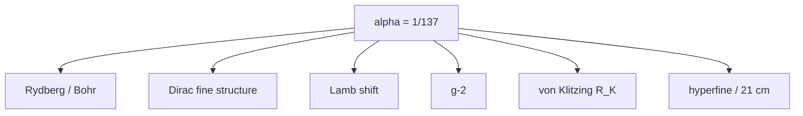

**Connectors:** *1/2alpha^2m_e c^2* &rarr; Rydberg / Bohr &middot; *~ alpha^2* &rarr; Dirac fine structure &middot; *loop alpha* &rarr; Lamb shift &middot; *alpha/2pi* &rarr; g-2 &middot; *Z_0/2alpha* &rarr; von Klitzing R_K &middot; *~ alpha^4* &rarr; hyperfine / 21 cm

**Open:** [`Alpha.md`](Alpha.md) · [`Hydrogen.md`](Hydrogen.md) · [`Dirac_Correction.md`](Dirac_Correction.md) · [`Lamb_Shift.md`](Lamb_Shift.md) · [`g_minus_2.md`](g_minus_2.md) · [`Electricity.md`](Electricity.md) · [`Magnetism_Spatial_Dynamics.md`](Magnetism_Spatial_Dynamics.md)

---

## 5. Gravity and GR

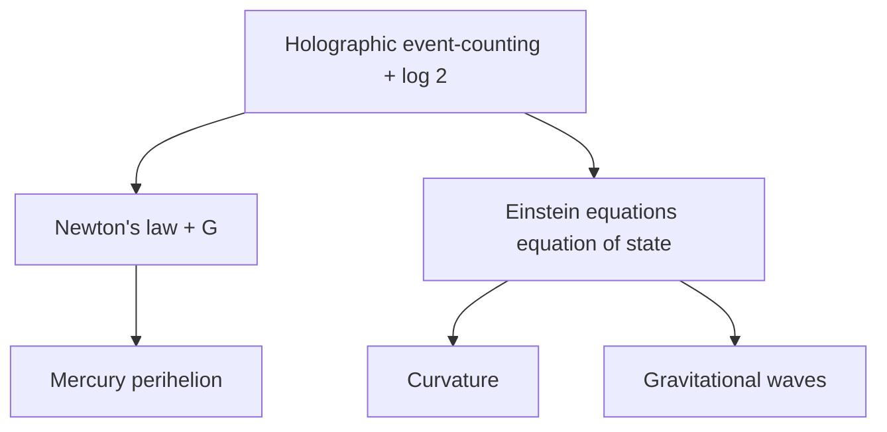

**Connectors:** *G = L_P^2c^3/hbar* &rarr; Newton's law + G &middot; *43''/century* &rarr; Mercury perihelion &middot; *deltaQ = T deltaS* &rarr; Einstein equations (equation of state) &middot; *causal order -> metric* &rarr; Curvature &middot; *spin-2, v = c* &rarr; Gravitational waves

**Open:** [`Gravity_From_Delay.md`](Gravity_From_Delay.md) · [`Mercury_Perihelion.md`](Mercury_Perihelion.md) · [`Einstein_Equations.md`](Einstein_Equations.md) · [`Curvature.md`](Curvature.md)

---

## 6. Cosmology and the dark sector

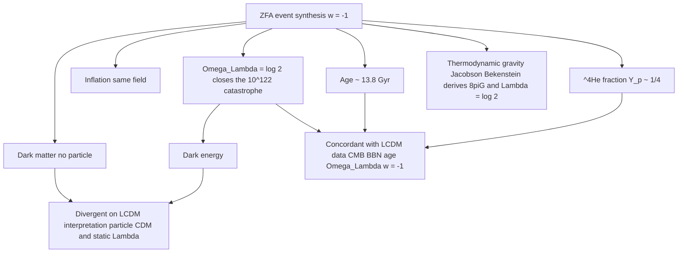

**Connectors:** *gauge 2/8* &rarr; Omega_Lambda = log 2 closes the 10^122 catas… &middot; *high-V epoch* &rarr; Inflation (same field) &middot; *denser logic* &rarr; Dark matter (no particle) &middot; *residual w = -1* &rarr; Dark energy &middot; *event rate* &rarr; Age ~ 13.8 Gyr &middot; *freeze-out n/p* &rarr; ^4He fraction Y_p ~ 1/4 &middot; *measured values* &rarr; Concordant with LCDM data &middot; *interpretive pillars* &rarr; Divergent on LCDM interpretation &middot; *equation of state* &rarr; Thermodynamic gravity

**Open:** [`Cosmological_Constant.md`](Cosmological_Constant.md) · [`Curvature.md`](Curvature.md) · [`DarkMatter.md`](DarkMatter.md) · [`SPARC.md`](SPARC.md) · [`AgeOfUniverse.md`](AgeOfUniverse.md) · [`Fusion.md`](Fusion.md) · [`Mysteries_Of_Physics.md`](Mysteries_Of_Physics.md) §3a

Dark matter is the closure-balance RAR, blind-tested parameter-free on 147 SPARC galaxies (`a₀ = cH₀/2π`, the `2π` derived; [`SPARC.md`](SPARC.md)). Dark energy is **dynamical** — `ρ_Λ ∝ H²` (Lean-anchored, `QLF_DynamicalDarkEnergy`) — so QLF sits in the *resolution-favorable* class of the **Hubble tension**, and its dark-matter fit votes local (`H₀ ≈ 72.9`); a reframe + vote, not a numeric resolution ([`DarkMatter.md`](DarkMatter.md) §5a).

**Convergence with accepted cosmology (the ledger, [`Mysteries_Of_Physics.md`](Mysteries_Of_Physics.md) §3a).** QLF is **concordant with ΛCDM's observational core** — the hot Big Bang, CMB, BBN (`Y_p = 1/4`), the ≈13.8 Gyr age, `Ω_Λ = log 2 ≈ 0.69`, and the `w≈−1` accelerating expansion are all reproduced or left intact (*a Big-Bang-singularity alternative, not a hot-Big-Bang-observation alternative*). It **diverges only on ΛCDM's two interpretive pillars** — particle cold dark matter (→ the RAR/MOND reading above) and a static `Λ` (→ dynamical `ρ_Λ ∝ H²`), i.e. the open, contested questions. Its **deeper convergence** is with accepted **thermodynamic/emergent gravity** (Jacobson 1995, Bekenstein–Hawking, holography), from which it *derives* the Einstein `8πG` coefficient and `Λ = log 2` (`QLF_EinsteinEquations`).

---

## 7. Particles and the Standard Model

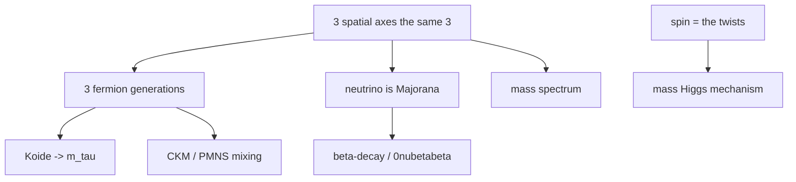

**Connectors:** *axis count* &rarr; 3 fermion generations &middot; *Q = 2/3* &rarr; Koide -> m_tau &middot; *3 angles + CP* &rarr; CKM / PMNS mixing &middot; *self-conjugate* &rarr; neutrino is Majorana &middot; *DeltaL = 2* &rarr; beta-decay / 0nubetabeta &middot; *one scale x ratios* &rarr; mass spectrum &middot; *m = 1/R fold delay* &rarr; mass (Higgs mechanism)

**Open:** [`Standard_Model.md`](Standard_Model.md) · [`Beta_Decay_Neutrino_Nature.md`](Beta_Decay_Neutrino_Nature.md) · [`Per_Qubit_Mass_Quantum.md`](Per_Qubit_Mass_Quantum.md) · [`Spin_QLF.md`](Spin_QLF.md) · [`Higgs.md`](Higgs.md)

---

## 8. Quantum-gravity / TOE pillars

QLF meets the three TOE-candidate programs — and reproduces their wins from the substrate.

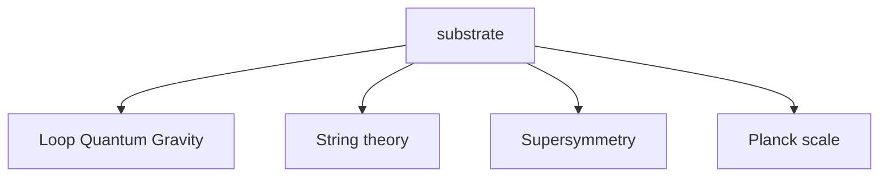

**Connectors:** *j = 1/2 spin network* &rarr; Loop Quantum Gravity &middot; *C(2n,n) modes* &rarr; String theory &middot; *Q = half-spin shift* &rarr; Supersymmetry &middot; *closure floor mu^2=1/2* &rarr; Planck scale

**Open:** [`README.md`](README.md) · [`LQG_QLF.md`](LQG_QLF.md) · [`StringTheory.md`](StringTheory.md) · [`SUSY_QLF.md`](SUSY_QLF.md) · [`Planck_Scale.md`](Planck_Scale.md)

---

## 9. The Millennium Prize program

The thesis: *the continuum and Choice are mathematics' UV catastrophe* — each problem = a constructive
RCA₀ core + one explicit continuum/Choice boundary axiom.

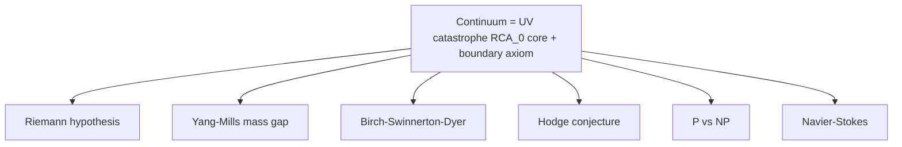

**Connectors:** *critical line* &rarr; Riemann hypothesis &middot; *log 2 gap quantum* &rarr; Yang-Mills mass gap &middot; *rank = ord* &rarr; Birch-Swinnerton-Dyer &middot; *balanced => algebraic* &rarr; Hodge conjecture &middot; *generate != verify* &rarr; P vs NP &middot; *no blow-up* &rarr; Navier-Stokes

**Open:** [`Continuum_Choice_Fallacy.md`](Continuum_Choice_Fallacy.md) · [`Riemann-Conjecture-Proof.md`](Riemann-Conjecture-Proof.md) · [`YangMills_MassGap_QLF.md`](YangMills_MassGap_QLF.md) · [`BSD_QLF.md`](BSD_QLF.md) · [`Hodge_QLF.md`](Hodge_QLF.md) · [`P_vs_NP_QLF.md`](P_vs_NP_QLF.md) · [`NavierStokes_QLF.md`](NavierStokes_QLF.md)

Overview: [`Millennium.md`](Millennium.md).

---

## 10. Beyond the SM

What QLF derives that the SM treats as free input, and the falsifiable predictions it makes.

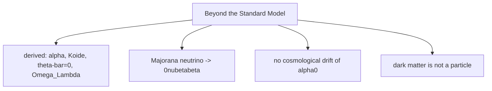

**Connectors:** *not free* &rarr; derived: alpha, Koide, theta-bar=0, Omega_La… &middot; *test now* &rarr; Majorana neutrino -> 0nubetabeta &middot; *scale-free by construction* &rarr; no cosmological drift of alpha(0) &middot; *soft* &rarr; dark matter is not a particle

**Open:** [`Beyond_Standard_Model.md`](Beyond_Standard_Model.md) · [`Beta_Decay_Neutrino_Nature.md`](Beta_Decay_Neutrino_Nature.md) · [`Alpha.md`](Alpha.md) · [`DarkMatter.md`](DarkMatter.md)

---

## See also

- [`README.md`](README.md) · [`lean/README.md`](lean/README.md) — project overview + the 89-module Lean
  table.
- [`Open_Problems.md`](Open_Problems.md) — the honest gap registry (closed / principled-boundary / open).
- [`Beyond_Standard_Model.md`](Beyond_Standard_Model.md) — the derived / predicted / open scorecard.
- [`Alpha.md`](Alpha.md) — one result mapped end to end, as a worked example.
